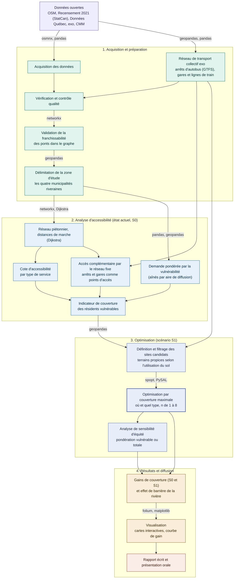

# Équité piétonne face à la barrière fluviale : optimisation des services essentiels à Beloeil - McMasterville et Mont-Saint-Hilaire - Otterburn Park
**Équipe :** Mylène Giraldeau


## Problématique
L'accès aux services essentiels à pied est un enjeu d'autonomie et d'inclusion pour les résidents qui ne disposent pas d'un accès facile à l'automobile. Les personnes âgées (65 ans et plus) en sont le groupe vulnérable candidat principal, plusieurs cessent de conduire tout en demeurant capables de marcher sur de courtes distances.

Le projet porte sur les quatre municipalités riveraines contiguës de la Vallée du Richelieu, Beloeil et McMasterville sur la rive ouest, Mont-Saint-Hilaire et Otterburn Park sur la rive est, séparées par la rivière Richelieu, franchissable seulement aux ponts. Cette barrière structure fortement l'accessibilité piétonne entre les deux rives, ce qui en fait un cas pertinent pour étudier l'équité d'accès.

L'accès aux services ne se limite toutefois pas à la marche, le réseau de transport collectif élargit la portée réelle des résidents vers les services situés au-delà d'une distance marchable. Le projet intègre donc le réseau fixe d'exo (emplacements des arrêts d'autobus et des gares de train) comme dimension complémentaire d'accès, sans tenir compte des horaires ni du temps réel.

Le projet évalue si les résidents les plus dépendants de la marche disposent d'un accès équitable aux services essentiels, afin de déterminer la nature et la localisation des nouveaux services à implanter pour maximiser la couverture. Il reprend et étend, avec l'accord de l'enseignant, le projet de session du cours GMQ210.

Les résultats concernent les villes visées et les décideurs publics, communautaires et privés. Le projet se limite à un diagnostic prospectif (l'implantation réelle revient aux décideurs) et n'aborde ni les horaires d'ouverture ni un indice de vulnérabilité multicritère.

La demande est analysée à l'échelle de l'aire de diffusion (Recensement 2021).

## Zone d'étude
Le territoire couvre les quatre municipalités riveraines contiguës, Beloeil et McMasterville (rive ouest), Mont-Saint-Hilaire et Otterburn Park (rive est), séparées par la rivière Richelieu. La demande est analysée à l'échelle de l'aire de diffusion, et les distances à l'échelle du réseau piétonnier.

La demande, les services, les résidences, le réseau et le transport sont tous mesurés sur l'ensemble de la zone, sans zone tampon. Les services s'y concentrent au cœur des villes et non aux franges, l'effet de bordure résiduel aux limites est documenté comme une limite du projet.

## Données

| Source | Format | CRS | Accès |
|--------|--------|-----|-------|
| Réseau piétonnier (OpenStreetMap) | Graphe (GraphML) | EPSG:2950 (MTM 8) | Extrait via [OSMnx](https://osmnx.readthedocs.io/en/stable/), reprojeté depuis EPSG:4326 |
| Points d'intérêt, services essentiels (OpenStreetMap) | Vectoriel (GeoPackage) | EPSG:2950 (MTM 8) | Extrait via OSMnx (étiquettes `amenity`, `shop`), reprojeté depuis EPSG:4326 |
| Bâtiments résidentiels (OpenStreetMap) | Vectoriel (GeoPackage) | EPSG:2950 (MTM 8) | Extrait via OSMnx (étiquette `building`), reprojeté depuis EPSG:4326 |
| Population et aînés (65 ans et plus) par aire de diffusion | CSV tabulaire | Aucun (table jointe par code d'AD) | [Statistique Canada, Recensement 2021 (profil)](https://www12.statcan.gc.ca/census-recensement/2021/dp-pd/prof/details/download-telecharger.cfm?Lang=F) |
| Limites des aires de diffusion | Shapefile | EPSG:2950 (MTM 8), reprojeté depuis EPSG:3347 | [Statistique Canada, limites 2021](https://www12.statcan.gc.ca/census-recensement/2021/geo/sip-pis/boundary-limites/index2021-fra.cfm?year=21) |
| Limites municipales | Shapefile | EPSG:2950 (MTM 8), reprojeté depuis EPSG:4269 | [Données Québec, découpages administratifs](https://www.donneesquebec.ca/recherche/dataset/decoupages-administratifs/resource/b368d470-71d6-40a2-8457-e4419de2f9c0) |
| Utilisation du sol (contraintes territoriales) | Vectoriel (Shapefile) | EPSG:2950 (MTM 8), reprojeté depuis EPSG:32188 | [CMM, utilisation du sol 2022](https://observatoire.cmm.qc.ca/produits/donnees-georeferencees/#utilisation_du_sol) |
| Arrêts du réseau d'autobus (exo – Vallée du Richelieu) | GTFS (fichiers texte) | EPSG:2950 (MTM 8), reprojeté depuis EPSG:4326 | [exo, données ouvertes (GTFS)](https://exo.quebec/fr/a-propos/donnees-ouvertes) |
| Gares de train (exo) | GeoJSON (points) | EPSG:2950 (MTM 8), reprojeté depuis EPSG:4326 | [Données Québec, gares de train exo](https://www.donneesquebec.ca/recherche/dataset/gares-de-train-exo/resource/8c169002-866c-40e8-babd-2be7186cb17c) |
| Lignes de train (exo) | GeoJSON (lignes) | EPSG:2950 (MTM 8), reprojeté depuis EPSG:4326 | [Données Québec, lignes de train exo](https://www.donneesquebec.ca/recherche/dataset/lignes-de-train-exo/resource/0f7d6393-e43e-48b3-ab8c-a3d48b36cac6) |
| Plans d'eau, rivière Richelieu (OpenStreetMap) | Vectoriel (GeoPackage) | EPSG:2950 (MTM 8), reprojeté depuis EPSG:4326 | Extrait via OSMnx (étiquette `natural=water`), contexte cartographique |

Toutes les couches sont ramenées au CRS cible commun EPSG:2950 (NAD83(CSRS) / MTM zone 8) avant analyse. Les données brutes ne sont pas versionnées, elles sont régénérées par `download_data.py` (voir `.gitignore`).

## Modèle de données
Ce projet n'utilise pas de serveur de base de données.

## Pipeline de traitement
**Structure du projet évolutive.** L'arborescence suit le principe « un module, une responsabilité » et reprend les catégories du cours. Elle pourra évoluer en cours de route. Des modules très courts et toujours modifiés ensemble pourront être fusionnés, et de nouveaux pourront être ajoutés si une étape se précise.

Le traitement suit une chaîne séquentielle et reproductible. L'accessibilité est mesurée de deux façons complémentaires : une cote par type de service par lieu résidentiel, qui révèle quel service manque et où, et un indicateur de couverture des résidents vulnérables par aire de diffusion, qui pilote l'optimisation. L'accès marchable est complété par l'accès au réseau de transport collectif fixe (arrêts d'autobus et gares comme points d'accès). L'optimisation par couverture maximale détermine à la fois où ajouter des services et de quels types.


## Librairies principales
- **osmnx** : téléchargement et modélisation du réseau piétonnier et des points d'intérêt d'OpenStreetMap.
- **networkx** : plus courts chemins avec l'algorithme de Dijkstra pour mesurer les distances réelles de marche.
- **geopandas / pandas** : manipulation des données géospatiales et tabulaires, lecture des fichiers GTFS et GeoJSON du réseau de transport, jointures et reprojections (EPSG:2950).
- **spopt (PySAL)** : modèle de localisation-allocation à couverture maximale.
- **folium** : cartes de couverture interactives avant et après optimisation.
- **matplotlib** : graphiques de performance, dont la courbe de rendement de l'ajout de 1 à 5 services.
- **pytest / pytest-cov** : tests unitaires des fonctions critiques (reprojection, géométries, calculs d'accessibilité) et mesure de couverture, exécutés en intégration continue (GitHub Actions).

## Installation et environnement
Les paramètres (CRS cible EPSG:2950, zone d'étude, seuils de marche, types de services, chemins) sont centralisés dans `config.yaml` et chargés par `config_loader.py`, qui valide la configuration avant tout accès aux données. Aucun paramètre n'est codé en dur dans les scripts.

**Avec conda (recommandé)**
```bash
conda env create -f environment.yml
conda activate gmq580_ps_mg
```

**Avec pip**
```bash
python -m venv venv
source venv/bin/activate      # sous Windows : venv\Scripts\activate
pip install -r requirements.txt
```

**Régénérer les données puis exécuter le pipeline**
```bash
python download_data.py       # régénère les données brutes (non versionnées)
python main.py                # exécute le pipeline complet
```

## Tests et intégration continue
Les tests ciblent les fonctions critiques où un bug reste silencieux mais fausse le résultat spatial (reprojection vers EPSG:2950, validité des géométries, cote d'accessibilité, pondération de la demande). Les données de test sont de petits objets synthétiques (`tests/fixtures/`), jamais les données réelles du projet. Chaque module d'analyse est couvert par des tests sur données synthétiques, 37 tests s'exécutent localement et en intégration continue.

**Lancer les tests localement**
```bash
pytest tests/ -v
```

**Couverture de code**
```bash
pytest tests/ --cov=src --cov-report=term-missing
```

Le workflow GitHub Actions (`.github/workflows/ci.yml`) vérifie la qualité du code avec `ruff` puis rejoue `pytest` à chaque `push` et `pull request` sur `main`. Le badge en haut de ce README reflète l'état du dernier passage (vert = tests réussis). Les hooks `pre-commit` (`black`, `ruff`) appliquent les mêmes règles localement avant chaque commit.

| Test | Vérifie | Statut |
|------|---------|--------|
| `test_io.py` | Reprojection correcte vers EPSG:2950 | ✅ Implanté |
| `test_config_loader.py` | Chargement et validation de `config.yaml` (sections obligatoires, CRS cible) | ✅ Implanté |
| `test_graph.py` | Distances de plus court chemin (Dijkstra) sur un mini-graphe connu | ✅ Implanté |
| `test_accessibility.py` | Cote d'accessibilité par type de service et accès au transport | ✅ Implanté |
| `test_demand.py` | Extraction de la population et pondération de la demande (aînés par AD) | ✅ Implanté |
| `test_coverage.py` | Indicateur de couverture des résidents vulnérables par aire de diffusion | ✅ Implanté |
| `test_buildings.py` | Filtrage des bâtiments résidentiels, dont le cas `yes` croisé avec l'usage du sol | ✅ Implanté |
| `test_validation.py` | Règles d'audit (CRS, géométries, doublons) et détection des liens traversant la rivière | ✅ Implanté |
| `test_optimization.py` | Couverture maximale sur une matrice minuscule à solution connue | ✅ Implanté |

## Livrables attendus
- Un dépôt GitHub reproductible contenant l'ensemble du pipeline, avec tests unitaires et intégration continue.
- Deux cartes interactives de la couverture actuelle (S0), marche seule puis marche et transport collectif fixe.
- Une carte interactive par scénario optimisé (S1, accès à pied), aux paliers de 2, 4, 6 et 8 services ajoutés dans des zones distinctes, avec la localisation et le type de chaque service recommandé.
- Une courbe de gain selon le nombre de services ajoutés (de 1 à 8).
- Une analyse de sensibilité d'équité (pondération vulnérable contre population totale).
- Un chiffrage de l'effet de barrière de la rivière Richelieu.
- Un rapport final écrit (15 à 20 pages) et une présentation orale (10 à 15 minutes).

## État d'avancement

| Étape | Statut |
|-------|--------|
| Cadrage et réorientation du projet (services essentiels) | ✅ Complété |
| Structuration du dépôt GitHub (arborescence du projet, `.gitignore`, branches) | ✅ Complété |
| Acquisition des données (OSM, recensement, Données Québec, exo, CMM) | ✅ Complété |
| Intégration du réseau de transport collectif (arrêts d'autobus, gares et lignes de train) | ✅ Complété |
| Environnement conda (`environment.yml`) et dépendances (`requirements.txt`) | ✅ Complété |
| Tests unitaires (`pytest`) et intégration continue (GitHub Actions) | ✅ Complété |
| Vérification et contrôle qualité des données | ✅ Complété |
| Validation de la franchissabilité des ponts dans le graphe | ✅ Complété |
| Délimitation de la zone d'étude (quatre municipalités riveraines) | ✅ Complété |
| Calcul de l'accessibilité par type de service (état actuel, S0) | ✅ Complété |
| Accès complémentaire par le réseau de transport fixe (arrêts, gares) | ✅ Complété |
| Pondération de la demande par la vulnérabilité (aînés par AD) | ✅ Complété |
| Définition et filtrage des sites candidats | ✅ Complété |
| Optimisation par couverture maximale avec `spopt` (S1, n = 1 à 8) | ✅ Complété |
| Analyse de sensibilité d'équité | ✅ Complété |
| Production des résultats (gains, effet de barrière) | ✅ Complété |
| Cartes interactives et graphiques | ✅ Complété |
| Vérification d'ensemble du projet (résultats, cartes, cohérence du dépôt) | 🔄 En cours |
| Rédaction du rapport et préparation de la présentation orale | ⏳ À faire |

## Décisions méthodologiques
- **Réorientation du projet.** Après le constat que la zone était déjà saturée d'arrêts à la demande (ancienne version sur le transport collectif), le projet a évolué vers l'accessibilité aux services essentiels, ce qui permet aussi d'optimiser le type de service à ajouter.
- **Reprise et extension de GMQ210.** Avec l'accord de l'enseignant, le projet réutilise l'approche d'accessibilité piétonne de GMQ210 (OSM, Dijkstra, cotation par type), à laquelle s'ajoutent la pondération par la vulnérabilité, la barrière fluviale et l'optimisation.
- **Facteur de vulnérabilité.** Le choix de travail s'arrête sur les 65 ans et plus, une donnée robuste du recensement qui évite les biais des données manquantes et des indices composites.
- **Mesure par la couverture.** La couverture, plutôt que la distance moyenne, est retenue comme indicateur principal. Les seuils de marche seront fixés à partir des paliers de GMQ210 et de valeurs plus usuelles comme 400 et 800 mètres par exemple.
- **Posture diagnostique.** L'optimisation indique où le manque est le plus grand et quel type de service le comblerait le mieux, ce qui sert autant les décideurs publics et communautaires que les acteurs privés.
- **Intégration du réseau de transport collectif (7 juillet 2026).** L'accès aux services ne se mesure pas uniquement par la marche réelle, les villes à l'étude sont desservies par le réseau d'exo. Le réseau fixe (arrêts d'autobus du GTFS de la CITVR, gares de train) est donc intégré comme dimension complémentaire d'accès, les arrêts et gares agissant comme points d'accès vers les services situés au-delà d'une distance marchable.
- **Réseau fixe seulement, sans horaires ni temps réel (7 juillet 2026).** Seuls les emplacements des arrêts et des gares sont considérés, sans horaires, fréquences ni temps réel. Les villes sont aussi couvertes par un service de transport à la demande, mais les emplacements des arrêts de ce service ne sont pas diffusés ([exo à la demande](https://exoalademande.exo.quebec/search)). À défaut de cette source, l'analyse se limite au réseau fixe, ce qui garde le traitement reproductible et vérifiable.
- **Rôle du train, complémentaire (7 juillet 2026).** La zone compte deux gares (McMasterville et Mont-Saint-Hilaire, ligne Mont-Saint-Hilaire), soit des points d'accès complémentaires au même titre que les arrêts d'autobus, mais bien moins nombreux. Les arrêts d'autobus (plus denses) constituent la principale couche d'accès au transport dans la couverture S0, et les lignes de train ne sont conservées que comme repère cartographique dans la zone.
- **Étiquettes OSM des bâtiments résidentiels (9 juillet 2026).** L'expérience de GMQ210 a montré qu'une seule étiquette ne suffit pas à capter toutes les résidences. La liste des valeurs `building` retenues est donc centralisée dans `config.yaml` (dont `house`, absente de la liste GMQ210, et les valeurs usuelles en banlieue québécoise), complétée par les nœuds d'adresse isolés (`addr:housenumber`) et par le réseau piétonnier extrait avec `network_type` défini en configuration. La valeur générique `yes`, ambiguë, ne compte comme résidentielle que si le bâtiment tombe dans un polygone d'usage résidentiel de la CMM (codes 100 à 114). Les types écartés seront journalisés par l'audit afin de vérifier qu'aucun type pertinent ne manque dans la zone.
- **Pondération de l'importance des services (10 juillet 2026).** Tous les services ne pèsent pas également dans l'autonomie d'une personne âgée. Un poids d'importance par type est défini dans `config.yaml`, les services du quotidien comme l'épicerie et la pharmacie pèsent le plus lourd, l'école pèse peu car elle sert surtout aux déplacements intergénérationnels. Cette pondération guide le choix du panier de services à ajouter et la couverture moyenne affichée sur les cartes, alors que les courbes de gain par type restent présentées en personnes non pondérées.
- **Transport collectif intégré à la couverture S0 (10 juillet 2026).** L'accès par le réseau fixe est maintenant mesuré dans la couverture. Un résident est couvert pour un type de service s'il l'atteint à pied sous le seuil, ou s'il atteint un arrêt à distance de marche alors qu'un arrêt du réseau se trouve aussi à distance de marche d'un service de ce type. Le réseau fixe local est traité comme un tout connecté, sans horaires ni correspondances, une simplification assumée qui reste cohérente avec la décision du 7 juillet. Deux cartes S0 sont produites, marche seule puis marche avec transport, ce qui rend l'apport du réseau directement visible.
- **Scénarios S1 en panier de services mixte (10 juillet 2026).** Plutôt que d'ajouter n services d'un même type, chaque étape du scénario retient le type et le site qui rapportent le plus une fois pondérés par l'importance, en résolvant une couverture maximale à un site par type sur la demande encore non couverte. Le panier final peut donc mélanger une épicerie, une pharmacie et d'autres types, et chaque étape produit sa carte avec la couverture recalculée, ce qui rend le gain visible aire par aire.
- **Zone d'étude élargie aux quatre municipalités, sans zone tampon (10 juillet 2026).** Les premières cartes ont montré que les services se concentrent au cœur des villes et que les aires de diffusion de McMasterville et d'Otterburn Park laissaient des vides incohérents à l'affichage. La demande, les services, les résidences et le transport de ces deux municipalités sont donc intégrés à l'étude au même titre que Beloeil et Mont-Saint-Hilaire, et le principe de zone tampon est retiré. L'effet de bordure résiduel aux limites est documenté comme une limite du projet.
- **Scénarios S1 recentrés sur la marche, dans des zones distinctes (10 juillet 2026).** Les cartes S0 montrent que le réseau de transport dessert déjà bien les aînés dans la situation actuelle. L'optimisation vise donc l'accès à pied, celui qui mérite le plus d'être amélioré. Pour éviter que tous les ajouts se concentrent au même endroit, un site choisi ferme ses environs immédiats (moins de la distance d'espacement configurée, 500 m) aux étapes suivantes, chaque ajout dessert ainsi une zone différente avec le service le plus pertinent pour cette zone.
- **Sites candidats hors du tissu résidentiel (10 juillet 2026).** Les premiers scénarios plaçaient parfois un service sur un terrain résidentiel déjà occupé. Les codes résidentiels de la CMM sont donc exclus des sites candidats, un nouveau service ne peut s'implanter que sur un terrain commercial, de bureau, institutionnel ou vacant, ce qui rend les recommandations directement plaidables auprès des décideurs.

## Difficultés rencontrées
- **Complétude d'OpenStreetMap.** La qualité des données en milieu périurbain (Beloeil et Mont-Saint-Hilaire) peut varier, pour le réseau comme pour les services. Aucune couche équivalente de Données Québec ou de la MRC n'est diffusée pour permettre un croisement systématique. La vérification s'appuiera donc sur l'imagerie aérienne (orthophotos) et une inspection manuelle ciblée, et les manques résiduels seront documentés comme une limite du projet.
- **Franchissabilité des ponts dans OSM.** La franchissabilité piétonne des ponts sur le Richelieu doit être validée à partir de ce qu'OSM fournit réellement (présence ou non des trottoirs sur les ponts). État : à vérifier. Piste : un module dédié (`bridges.py`) contrôle la présence d'un chemin piéton continu d'une rive à l'autre, croisé au besoin avec l'imagerie aérienne (orthophotos).
- **Données du transport à la demande indisponibles.** Les emplacements des arrêts du service exo à la demande ne sont pas diffusés publiquement. État : contourné. Piste : se limiter au réseau fixe (arrêts du GTFS et gares de train).
- **Hétérogénéité des systèmes de coordonnées.** Les sources arrivent dans des CRS différents (OSM et exo en EPSG:4326, aires de diffusion en EPSG:3347, limites municipales en EPSG:4269, utilisation du sol en EPSG:32188). État : maîtrisé. Piste : une fonction de reprojection unique vers EPSG:2950, couverte par un test unitaire, appliquée à toutes les couches avant analyse pour éviter les jointures spatiales silencieusement fausses.
- **Effet de bordure spatiale.** Les services situés juste au-delà des limites de la zone d'étude ne sont pas comptés. L'observation des cartes montre que les services se concentrent au cœur des quatre municipalités et non aux franges, l'effet résiduel est donc jugé faible et documenté comme une limite du projet.
- **Agrégation des données de recensement.** La demande est diffusée par aire de diffusion, pas par adresse, alors que le calcul d'accessibilité se fait entre points précis (résidences et services), ce qui introduit une perte de précision à garder en tête.
- **Choix du facteur de vulnérabilité.** Le facteur est limité aux données disponibles. Un seul critère est retenu (65 ans et plus) par souci de simplicité, alors que plusieurs pourraient être combinés et pondérés.
- **Modélisation simplifiée de l'offre et de la demande.** La demande correspond au compte d'aînés par aire de diffusion, chaque personne pèse également, sans nuance d'intensité du besoin. Du côté de l'offre, l'importance relative des types de services est pondérée dans la configuration (une épicerie pèse plus lourd qu'un bureau de poste pour l'autonomie des aînés), mais à l'intérieur d'un même type chaque service reste traité comme équivalent, sans égard à sa taille ni à sa capacité d'accueil. Ces raffinements demanderaient des données d'achalandage et de capacité qui ne sont pas diffusées.
- **Pondération d'importance non validée auprès des aînés.** Les poids d'importance attribués aux types de services n'ont pas été établis en consultant la communauté aînée, ils ont été fixés dans le cadre du projet selon notre propre jugement, en s'appuyant sur le rôle de chaque service dans l'autonomie du quotidien. Une enquête ou un groupe de discussion permettrait de valider ou d'ajuster ces poids, la configuration centralisée rend d'ailleurs cet ajustement immédiat.
