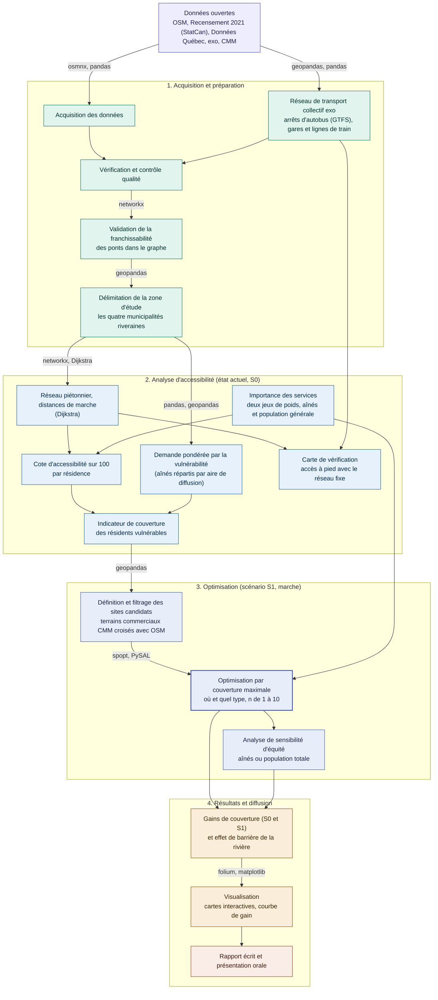

# Accessibilité piétonne aux services essentiels et optimisation pour les aînés à Beloeil, McMasterville, Mont-Saint-Hilaire et Otterburn Park
**Équipe.** Mylène Giraldeau


## Problématique
L'accès aux services essentiels à pied est un enjeu d'autonomie et d'inclusion pour les résidents qui ne disposent pas d'un accès facile à l'automobile. Les personnes âgées de 65 ans et plus forment le groupe vulnérable candidat principal. Plusieurs cessent de conduire tout en demeurant capables de marcher sur de courtes distances.

Le projet porte sur les quatre municipalités riveraines contiguës de la Vallée du Richelieu. Beloeil et McMasterville sont sur la rive ouest, Mont-Saint-Hilaire et Otterburn Park sur la rive est, séparées par la rivière Richelieu franchissable seulement aux ponts.

L'étude se concentre sur l'amélioration de l'accès à pied. La marche est le mode que certaines personnes âgées privilégient et qui mérite le plus d'être renforcé, car elles ne veulent pas toujours avoir recours à l'autobus. Le réseau de transport collectif d'exo sert seulement à vérifier si le besoin d'ajouter des services est réel une fois le transport pris en compte. Une carte montre cet apport. Elle confirme que le transport dessert déjà bien l'accès, ce qui justifie de centrer l'optimisation sur la marche.

Le projet évalue si les résidents les plus dépendants de la marche disposent d'un accès équitable aux services essentiels. Il détermine ensuite la nature et la localisation des nouveaux services à implanter pour maximiser la couverture. Il reprend et étend, avec l'accord de l'enseignant, le projet de session du cours GMQ210.

Les résultats concernent les villes visées et les décideurs publics, communautaires et privés. Le projet se limite à un diagnostic prospectif. L'implantation réelle revient aux décideurs. Il n'aborde ni les horaires d'ouverture ni un indice de vulnérabilité multicritère.

## Zone d'étude
Le territoire couvre les quatre municipalités riveraines contiguës. Beloeil et McMasterville sont sur la rive ouest, Mont-Saint-Hilaire et Otterburn Park sur la rive est.

La demande des personnes âgées est diffusée par aire de diffusion du Recensement 2021. Les distances sont mesurées sur le réseau piétonnier. La demande, les services, les résidences, le réseau et le transport sont tous mesurés sur l'ensemble de la zone, sans zone tampon.

Les services se trouvent surtout au cœur des villes et non aux limites. Quelques services situés juste au-delà des limites ne sont donc pas comptés. Cet effet reste faible et il est noté comme une limite du projet.

## Données

| Source | Format | CRS | Accès |
|--------|--------|-----|-------|
| Réseau piétonnier (OpenStreetMap) | Graphe (GraphML) | EPSG:2950 (MTM 8) | Extrait via [OSMnx](https://osmnx.readthedocs.io/en/stable/), reprojeté depuis EPSG:4326 |
| Points d'intérêt, services essentiels (OpenStreetMap) | Vectoriel (GeoPackage) | EPSG:2950 (MTM 8) | Extrait via OSMnx (étiquettes `amenity`, `shop`, `healthcare`), reprojeté depuis EPSG:4326 |
| Bâtiments résidentiels (OpenStreetMap) | Vectoriel (GeoPackage) | EPSG:2950 (MTM 8) | Extrait via OSMnx (étiquette `building`), reprojeté depuis EPSG:4326 |
| Terrains commerciaux (OpenStreetMap) | Vectoriel (GeoPackage) | EPSG:2950 (MTM 8) | Extrait via OSMnx (étiquette `landuse=commercial`), reprojeté depuis EPSG:4326 |
| Population et aînés de 65 ans et plus par aire de diffusion | CSV tabulaire | Aucun (table jointe par code d'AD) | [Statistique Canada, Recensement 2021 (profil)](https://www12.statcan.gc.ca/census-recensement/2021/dp-pd/prof/details/download-telecharger.cfm?Lang=F) |
| Limites des aires de diffusion | Shapefile | EPSG:2950 (MTM 8), reprojeté depuis EPSG:3347 | [Statistique Canada, limites 2021](https://www12.statcan.gc.ca/census-recensement/2021/geo/sip-pis/boundary-limites/index2021-fra.cfm?year=21) |
| Limites municipales | Shapefile | EPSG:2950 (MTM 8), reprojeté depuis EPSG:4269 | [Données Québec, découpages administratifs](https://www.donneesquebec.ca/recherche/dataset/decoupages-administratifs/resource/b368d470-71d6-40a2-8457-e4419de2f9c0) |
| Utilisation du sol (contraintes territoriales) | Vectoriel (Shapefile) | EPSG:2950 (MTM 8), reprojeté depuis EPSG:32188 | [CMM, utilisation du sol 2022](https://observatoire.cmm.qc.ca/produits/donnees-georeferencees/#utilisation_du_sol) |
| Arrêts du réseau d'autobus (exo, Vallée du Richelieu) | GTFS (fichiers texte) | EPSG:2950 (MTM 8), reprojeté depuis EPSG:4326 | [exo, données ouvertes (GTFS)](https://exo.quebec/fr/a-propos/donnees-ouvertes) |
| Gares de train (exo) | GeoJSON (points) | EPSG:2950 (MTM 8), reprojeté depuis EPSG:4326 | [Données Québec, gares de train exo](https://www.donneesquebec.ca/recherche/dataset/gares-de-train-exo/resource/8c169002-866c-40e8-babd-2be7186cb17c) |
| Lignes de train (exo) | GeoJSON (lignes) | EPSG:2950 (MTM 8), reprojeté depuis EPSG:4326 | [Données Québec, lignes de train exo](https://www.donneesquebec.ca/recherche/dataset/lignes-de-train-exo/resource/0f7d6393-e43e-48b3-ab8c-a3d48b36cac6) |
| Plans d'eau, rivière Richelieu (OpenStreetMap) | Vectoriel (GeoPackage) | EPSG:2950 (MTM 8), reprojeté depuis EPSG:4326 | Extrait via OSMnx (étiquette `natural=water`), contexte cartographique |

Toutes les couches sont ramenées au CRS cible commun EPSG:2950 (NAD83(CSRS) / MTM zone 8) avant analyse. Les données brutes ne sont pas versionnées. Elles sont régénérées par `download_data.py` (voir `.gitignore`).

## Modèle de données
Ce projet n'utilise pas de serveur de base de données.

## Pipeline de traitement
**Structure du projet évolutive.** L'arborescence suit le principe d'un module pour une responsabilité et reprend les catégories du cours. Elle peut évoluer en cours de route. Des modules très courts et toujours modifiés ensemble peuvent être fusionnés, et de nouveaux peuvent être ajoutés si une étape se précise. Le fichier `main.py` orchestre seulement, tout le traitement est délégué aux modules de `src`.

Le traitement suit une chaîne séquentielle et reproductible. Une cote sur 100 est calculée pour chaque résidence à partir de la distance de marche vers chaque type de service, comme dans GMQ210. Un indicateur de couverture des aînés par aire de diffusion pilote l'optimisation. Le réseau de transport collectif fixe sert seulement à produire une carte S0 de vérification, il n'entre pas dans l'optimisation. L'optimisation par couverture maximale détermine à la fois où ajouter des services et de quels types.



## Librairies principales
- **osmnx**, téléchargement et modélisation du réseau piétonnier et des points d'intérêt d'OpenStreetMap.
- **networkx**, plus courts chemins avec l'algorithme de Dijkstra pour mesurer les distances réelles de marche.
- **geopandas** et **pandas**, manipulation des données géospatiales et tabulaires, lecture des fichiers GTFS et GeoJSON, jointures et reprojections.
- **shapely**, construction et manipulation des géométries vectorielles.
- **pyproj**, reprojection des couches vers le CRS cible EPSG:2950.
- **rtree**, index spatial qui accélère les jointures spatiales.
- **numpy**, calculs de la matrice de distances et des poids de demande.
- **mapclassify**, classification des valeurs pour les cartes.
- **spopt (PySAL)** et **pulp**, modèle de localisation-allocation à couverture maximale et solveur d'optimisation.
- **folium**, cartes d'accessibilité interactives avant et après optimisation.
- **matplotlib**, graphiques de performance, dont la courbe de rendement de l'ajout de 1 à 10 services.
- **pyyaml**, lecture du fichier de configuration `config.yaml`.
- **pytest** et **pytest-cov**, tests unitaires des fonctions critiques et mesure de couverture, exécutés en intégration continue.

## Installation et environnement
Les paramètres du projet sont centralisés dans `config.yaml` et chargés par `config_loader.py`, qui valide la configuration avant tout accès aux données. Aucun paramètre n'est codé en dur dans les scripts. La configuration couvre les CRS, la zone d'étude, les étiquettes OSM, les seuils de marche, les pondérations, l'optimisation, l'apparence des cartes et les chemins.

**Avec conda (recommandé)**
```bash
conda env create -f environment.yml
conda activate gmq580_ps_mg
```

**Avec pip**
```bash
python -m venv venv
source venv/bin/activate      # sous Windows, venv\Scripts\activate
pip install -r requirements.txt
```

**Régénérer les données puis exécuter le pipeline**
```bash
python download_data.py       # régénère les couches OSM (non versionnées)
python main.py                # exécute le pipeline complet
```

**Avec Docker (environnement système complet)**
Le `Dockerfile` part d'une image qui contient déjà GDAL et ses dépendances système, ce qui garantit le même résultat sur toute machine. Les dossiers de données et de sorties sont montés pour rester accessibles après l'exécution.
```bash
docker build -t gmq580_ps_mg .
docker run --rm -v ${PWD}/data:/app/data -v ${PWD}/outputs:/app/outputs gmq580_ps_mg
```

## Tests et intégration continue
Les tests ciblent les fonctions critiques où un bug reste silencieux mais fausse le résultat spatial, comme la reprojection vers EPSG:2950, la validité des géométries, la cote d'accessibilité et la pondération de la demande. Les données de test sont de petits objets synthétiques construits directement dans les tests, jamais les données réelles du projet. Chaque module d'analyse est couvert par des tests sur données synthétiques.

**Lancer les tests localement**
```bash
pytest tests/ -v
```

**Couverture de code**
```bash
pytest tests/ --cov=src --cov-report=term-missing
```

Le workflow GitHub Actions (`.github/workflows/ci.yml`) vérifie la qualité du code avec `ruff` puis rejoue `pytest` à chaque `push` et `pull request` sur `main`. Le badge en haut de ce README reflète l'état du dernier passage (vert égale tests réussis). Les hooks `pre-commit` (`black`, `ruff`) appliquent les mêmes règles localement avant chaque commit.

| Test | Vérifie | Statut |
|------|---------|--------|
| `test_io.py` | Reprojection correcte vers EPSG:2950 | ✅ Implanté |
| `test_config_loader.py` | Chargement et validation de `config.yaml` | ✅ Implanté |
| `test_graph.py` | Distances de plus court chemin (Dijkstra) sur un mini-graphe connu | ✅ Implanté |
| `test_accessibility.py` | Cote sur 100 par résidence et accès par le transport | ✅ Implanté |
| `test_demand.py` | Extraction de la population et répartition des aînés par AD | ✅ Implanté |
| `test_coverage.py` | Indicateur de couverture des résidents vulnérables | ✅ Implanté |
| `test_buildings.py` | Filtrage des bâtiments résidentiels, dont le cas `yes` croisé avec l'usage du sol | ✅ Implanté |
| `test_validation.py` | Règles d'audit et détection des liens traversant la rivière | ✅ Implanté |
| `test_optimization.py` | Couverture maximale sur une matrice minuscule à solution connue | ✅ Implanté |

## Livrables attendus
- Un dépôt GitHub reproductible contenant l'ensemble du pipeline, avec tests unitaires exécutés en intégration continue et un `Dockerfile` pour l'environnement système complet.
- Trois cartes interactives de l'accessibilité actuelle S0, l'accès à pied des aînés, l'accès à pied de la population générale et l'accès à pied des aînés avec le réseau de transport fixe.
- Des cartes interactives des scénarios optimisés S1 (accès à pied), aux paliers de 2, 6 et 10 services ajoutés pour les aînés et au palier de 10 services pour la population générale, avec la localisation et le type de chaque service recommandé.
- Une courbe de gain qui compare la part couverte des aînés et de la population générale pour l'ajout de 1 à 10 services.
- Une analyse de sensibilité d'équité qui compare la pondération des aînés et celle de la population totale.
- Un chiffrage de l'effet de barrière de la rivière Richelieu.
- Un document écrit final de 10 pages maximum et une présentation orale de 10 minutes.

## État d'avancement

| Étape | Statut |
|-------|--------|
| Cadrage et réorientation du projet (services essentiels) | ✅ Complété |
| Structuration du dépôt GitHub (arborescence du projet, `.gitignore`, branches) | ✅ Complété |
| Acquisition des données (OSM, recensement, Données Québec, exo, CMM) | ✅ Complété |
| Intégration du réseau de transport collectif (arrêts d'autobus, gares et lignes de train) | ✅ Complété |
| Environnement conda (`environment.yml`), dépendances (`requirements.txt`) et Docker (`Dockerfile`) | ✅ Complété |
| Tests unitaires (`pytest`) et intégration continue (GitHub Actions) | ✅ Complété |
| Vérification et contrôle qualité des données | ✅ Complété |
| Validation de la franchissabilité des ponts dans le graphe | ✅ Complété |
| Délimitation de la zone d'étude (quatre municipalités riveraines) | ✅ Complété |
| Assignation des poids d'importance par type de service, aînés et population générale | ✅ Complété |
| Cote d'accessibilité sur 100 par résidence, aînés et population générale | ✅ Complété |
| Carte de vérification de l'accès à pied avec le réseau de transport fixe | ✅ Complété |
| Pondération de la demande par la vulnérabilité (aînés répartis par AD) | ✅ Complété |
| Définition et filtrage des sites candidats (terrains commerciaux) | ✅ Complété |
| Optimisation par couverture maximale avec `spopt` (S1, n de 1 à 10) | ✅ Complété |
| Analyse de sensibilité d'équité | ✅ Complété |
| Production des résultats (gains, effet de barrière) | ✅ Complété |
| Cartes interactives et graphiques | ✅ Complété |
| Vérification d'ensemble du projet (résultats, cartes, cohérence du dépôt) | 🔄 En cours |
| Rédaction du rapport et préparation de la présentation orale | 🔄 En cours |

## Décisions méthodologiques
- **Réorientation vers les services essentiels et reprise de GMQ210 (2026-06-23).** La zone était déjà saturée d'arrêts à la demande, le projet a donc évolué du transport vers l'accessibilité aux services essentiels. Cela permet aussi d'optimiser le type de service à ajouter. Avec l'accord de l'enseignant, le projet réutilise l'approche piétonne de GMQ210, à savoir OSM, Dijkstra et une cote sur 100 par résidence, et y ajoute la pondération par la vulnérabilité et l'optimisation.
- **Zone d'étude sans zone tampon (2026-07-07).** Les quatre municipalités sont intégrées à l'étude au même titre, et le principe de zone tampon est retiré, car les aires de diffusion de McMasterville et d'Otterburn Park laissaient sinon des vides incohérents à l'affichage.
- **Effet de barrière faible et documenté (2026-07-14).** Le calcul compare la couverture des aînés avec et sans les ponts. L'écart est très faible, quelques aînés pour la santé et nul pour les autres types. La rivière structure la lecture des cartes, mais son effet sur la couverture reste mineur. Ce constat est conservé comme un résultat du projet.
- **Facteur de vulnérabilité et cote par résidence (2026-07-14).** Le critère retenu est les 65 ans et plus, une donnée robuste du recensement qui évite les biais des données manquantes et des indices composites. Chaque résidence reçoit une cote sur 100 selon sa distance de marche vers chaque service, pondérée par l'importance du service pour la population. Les aînés sont notés Excellent à moins de 200 mètres, la population générale à moins de 400 mètres, car elle tolère une marche plus longue. La distance minimale vers chaque service reste affichée même au delà des seuils. La couverture des aînés par aire de diffusion sert d'indicateur principal pour l'optimisation.
- **Deux pondérations d'importance des services (2026-07-14).** Deux jeux de poids sont définis dans `config.yaml`, un pour les aînés et un pour la population générale, car les deux populations ne privilégient pas les mêmes services. Ces poids guident la cote par résidence, le choix de l'assortiment à ajouter et la couverture moyenne des cartes.
- **Transport gardé pour vérification seulement (2026-07-14).** Le réseau fixe d'exo, arrêts d'autobus et gares, sert à produire une carte S0 qui montre l'accès une fois le transport pris en compte. Un service atteignable par le transport est compté selon la marche de la résidence vers un arrêt, plus la marche du meilleur arrêt vers le service, les deux marches devant rester courtes. Le service à la demande n'est pas diffusé publiquement et le train complète simplement l'autobus. Cette carte confirme que le transport dessert déjà bien les aînés, donc l'optimisation porte sur la marche seule.
- **Trois cartes S0 et sensibilité d'équité (2026-07-14).** Une carte montre l'accès à pied des aînés, une deuxième celui de la population générale et une troisième celui des aînés avec le transport. La comparaison des deux premières sert à l'analyse de sensibilité d'équité.
- **Scénarios S1 en assortiment mixte sur la marche (2026-07-14).** L'optimisation vise l'accès à pied, celui qui mérite le plus d'être amélioré. L'assortiment va jusqu'à 10 ajouts. Chaque étape retient le type et le site qui rapportent le plus une fois pondérés par l'importance, et un site choisi ferme ses environs immédiats pour que chaque ajout desserve une zone différente. Chaque résidence a sa propre cote, les aires de diffusion servent seulement à placer les services là où les aînés sont plus nombreux. Des cartes sont produites aux paliers 2, 6 et 10 pour les aînés et au palier 10 pour la population générale.
- **Bâtiments résidentiels et sites candidats (2026-07-14).** Une seule étiquette `building` ne suffit pas à capter toutes les résidences, la liste des valeurs retenues est donc centralisée dans `config.yaml` et complétée par les nœuds d'adresse isolés. La valeur générique `yes`, ambiguë, ne compte comme résidentielle que si le bâtiment tombe dans un polygone d'usage résidentiel de la CMM. Un nouveau service ne peut s'implanter que sur un vrai terrain commercial, les terrains de code 200 de la CMM sont donc croisés avec les polygones OpenStreetMap `landuse=commercial` et doivent être proches du réseau piétonnier.
- **Poids d'importance fondés sur la littérature (2026-07-16).** Les deux jeux de poids, distincts selon le type de service et le groupe visé, ne reposent plus sur un jugement personnel mais sur des études sur l'importance des services de proximité.
- **Étiquettes OSM élargies pour la complétude des services (2026-07-17).** Les étiquettes `healthcare` (santé, dentiste et pharmacie, types distincts conservés) et `amenity=childcare` (garderies) sont ajoutées à la configuration pour capter les établissements tagués autrement dans OSM. Les services encore manquants, dont des cliniques vétérinaires, seront ajoutés par contribution directe à OpenStreetMap puis re-téléchargement, ce qui reste entièrement reproductible.

## Difficultés rencontrées
- **Complétude et validation d'OpenStreetMap.** La qualité des données en milieu périurbain peut varier, pour le réseau comme pour les services. La franchissabilité piétonne des ponts sur le Richelieu est validée par le module `bridges.py`, qui contrôle un chemin piéton continu d'une rive à l'autre, croisé au besoin avec l'imagerie aérienne. Aucune couche équivalente n'étant diffusée, les manques résiduels sont documentés comme une limite du projet.
- **Données du transport à la demande indisponibles.** Les emplacements des arrêts du service exo à la demande ne sont pas diffusés publiquement. L'analyse se limite au réseau fixe, ce qui garde le traitement reproductible.
- **Hétérogénéité des systèmes de coordonnées.** Les sources arrivent dans des CRS différents. Une fonction de reprojection unique vers EPSG:2950, couverte par un test unitaire, est appliquée à toutes les couches avant analyse pour éviter les jointures spatiales silencieusement fausses.
- **Agrégation du recensement et effet de bordure.** Le nombre d'aînés d'une aire de diffusion est réparti sur les résidences de cette aire, tout le reste du calcul demeure entre points précis. Les services situés juste au-delà des limites ne sont pas comptés, mais les cartes montrent que les services se concentrent au cœur des villes, donc l'effet résiduel est jugé faible.
- **Modélisation simplifiée et pondérations non validées.** Un seul critère de vulnérabilité est retenu, et à l'intérieur d'un même type chaque service est traité comme équivalent, sans égard à sa taille ni à sa capacité. Les poids d'importance ont été fixés selon un jugement appuyé par la littérature sur les services de proximité, sans consulter la communauté aînée ni la population générale. Une enquête permettrait de les valider, et la configuration centralisée rend cet ajustement immédiat.

## Références
À compléter
