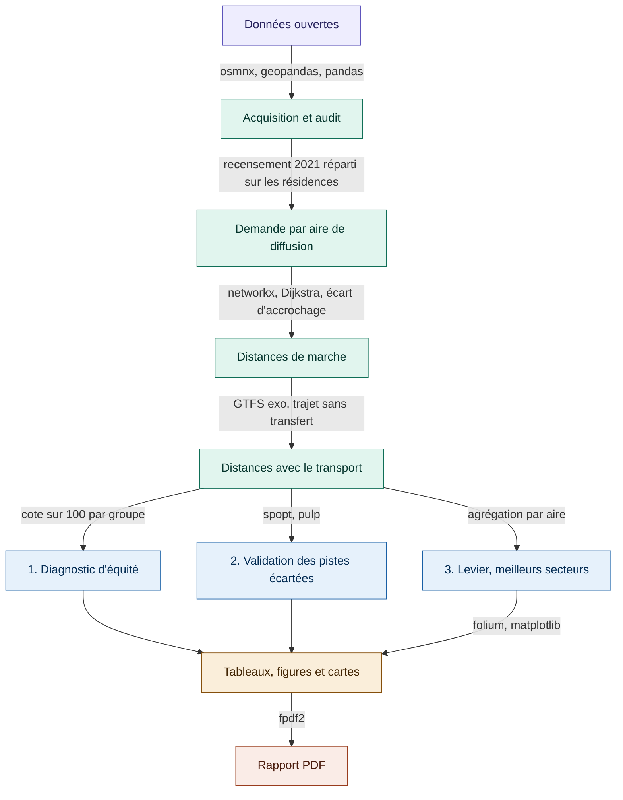

# Où vieillir à pied dans la Vallée du Richelieu, équité d'accès des aînés aux services essentiels et secteurs recommandés
**Équipe.** Mylène Giraldeau


## Problématique
L'accès à pied aux services essentiels est un enjeu d'autonomie. Les 65 ans et plus sont le groupe vulnérable principal. Plusieurs cessent de conduire tout en marchant encore sur de courtes distances. L'environnement bâti du quartier influence directement leurs déplacements actifs (Cerin et al., 2017). L'Organisation mondiale de la Santé (2007) fait de la proximité des services un critère central des villes-amies des aînés.

Le projet mesure cet accès à l'échelle du bâtiment, pour chaque résidence de quatre municipalités riveraines. Neuf types de services essentiels sont analysés, épicerie, pharmacie, santé, dépanneur, banque, dentiste, vétérinaire, école et garderie. Le transport collectif n'en fait pas partie, c'est un moyen d'atteindre ces services et non un service. Il forme le deuxième mode de déplacement après la marche.

Le projet suit trois volets.

- Le **diagnostic d'équité** compare les aînés au reste de la population et montre que leurs besoins diffèrent.
- La **validation** écarte deux pistes. L'ajout de nouveaux services rapporte trop peu, l'effet de barrière de la rivière est négligeable.
- Le **levier** retient la solution. Il recommande dans chaque ville le meilleur secteur d'adresses existantes et le meilleur secteur où implanter du logement.

Les résultats visent les municipalités et les décideurs publics, communautaires et privés. Le projet reprend l'approche piétonne du cours GMQ210, avec l'accord de l'enseignant. Il s'arrête au diagnostic et aux recommandations, l'implantation revient aux décideurs. Il n'aborde ni les horaires d'ouverture, ni la taille des établissements, ni un indice de vulnérabilité multicritère.

## Zone d'étude
Quatre municipalités riveraines contiguës de la Vallée du Richelieu. Beloeil et McMasterville sont sur la rive ouest, Mont-Saint-Hilaire et Otterburn Park sur la rive est. La rivière n'est franchissable qu'aux ponts, ce qui permet de tester un effet de barrière sur un territoire par ailleurs continu et de taille comparable.

La zone est traitée sans tampon. La demande vient des aires de diffusion du Recensement 2021, la plus petite unité pour laquelle tout le recensement est diffusé, de 400 à 700 habitants (Statistique Canada, 2021). Quelques services juste au delà des limites ne sont pas comptés, mais les services se concentrent au cœur des villes et l'effet reste faible.

## Données
Chaque source sert à une chose précise.

- **Les services essentiels.** Les points d'intérêt d'OpenStreetMap, filtrés par les étiquettes du tableau ci dessous. C'est la seule source qui décide de la présence d'un service.
- **L'accès.** Le réseau piétonnier porte toutes les distances de marche. Les arrêts et les gares ajoutent le deuxième mode. Les bâtiments et terrains résidentiels donnent le point de départ de chaque déplacement.
- **La demande et le contexte.** Le recensement et les aires de diffusion répartissent les aînés et le reste de la population. Les limites municipales rattachent chaque secteur à sa ville. Les terrains commerciaux et à développer servent de sites candidats. Les lignes de train et la rivière sont des repères cartographiques.

Un service est retenu s'il répond à un besoin courant, s'il se fréquente de façon répétée dans l'année et s'il est bien recensé dans OpenStreetMap. L'école et la garderie sont conservées même si les aînés les fréquentent peu, car les deux groupes sont comparés sur les mêmes services. C'est le poids d'importance, propre à chaque groupe, qui traduit la différence d'usage.

| Service essentiel | Étiquettes OpenStreetMap |
|-------------------|--------------------------|
| Épicerie | `shop=supermarket` |
| Pharmacie | `amenity=pharmacy`, `healthcare=pharmacy` |
| Santé | `amenity` hôpital, clinique et médecin, `healthcare` équivalent |
| Dépanneur | `shop=convenience` |
| Banque | `amenity=bank` |
| Dentiste | `amenity=dentist`, `healthcare=dentist` |
| Vétérinaire | `amenity=veterinary` |
| École | `amenity=school` |
| Garderie | `amenity=kindergarten`, `amenity=childcare` |

| Source | Format | CRS | Accès |
|--------|--------|-----|-------|
| Réseau piétonnier (OpenStreetMap) | Graphe GraphML | EPSG:2950, depuis EPSG:4326 | [OSMnx](https://osmnx.readthedocs.io/en/stable/) |
| Services essentiels (OpenStreetMap) | GeoPackage | EPSG:2950, depuis EPSG:4326 | OSMnx, étiquettes du tableau ci dessus |
| Bâtiments résidentiels (OpenStreetMap) | GeoPackage | EPSG:2950, depuis EPSG:4326 | OSMnx, étiquette `building` |
| Terrains résidentiels (OpenStreetMap) | GeoPackage | EPSG:2950, depuis EPSG:4326 | OSMnx, `landuse=residential` |
| Terrains commerciaux (OpenStreetMap) | GeoPackage | EPSG:2950, depuis EPSG:4326 | OSMnx, `landuse` commercial et retail |
| Terrains à développer (OpenStreetMap) | GeoPackage | EPSG:2950, depuis EPSG:4326 | OSMnx, `landuse` brownfield, greenfield et construction |
| Plans d'eau (OpenStreetMap) | GeoPackage | EPSG:2950, depuis EPSG:4326 | OSMnx, `natural=water` |
| Population et aînés par aire de diffusion | CSV | Aucun, joint par code d'AD | [Statistique Canada, Recensement 2021](https://www12.statcan.gc.ca/census-recensement/2021/dp-pd/prof/details/download-telecharger.cfm?Lang=F) |
| Limites des aires de diffusion | Shapefile | EPSG:2950, depuis EPSG:3347 | [Statistique Canada, limites 2021](https://www12.statcan.gc.ca/census-recensement/2021/geo/sip-pis/boundary-limites/index2021-fra.cfm?year=21) |
| Limites municipales | Shapefile | EPSG:2950, depuis EPSG:4269 | [Données Québec, découpages administratifs](https://www.donneesquebec.ca/recherche/dataset/decoupages-administratifs/resource/b368d470-71d6-40a2-8457-e4419de2f9c0) |
| Arrêts d'autobus (exo) | GTFS | EPSG:2950, depuis EPSG:4326 | [exo, données ouvertes](https://exo.quebec/fr/a-propos/donnees-ouvertes) |
| Gares de train (exo) | GeoJSON | EPSG:2950, depuis EPSG:4326 | [Données Québec, gares exo](https://www.donneesquebec.ca/recherche/dataset/gares-de-train-exo/resource/8c169002-866c-40e8-babd-2be7186cb17c) |
| Lignes de train (exo) | GeoJSON | EPSG:2950, depuis EPSG:4326 | [Données Québec, lignes exo](https://www.donneesquebec.ca/recherche/dataset/lignes-de-train-exo/resource/0f7d6393-e43e-48b3-ab8c-a3d48b36cac6) |

Toutes les couches sont ramenées au CRS commun EPSG:2950, soit NAD83(CSRS) / MTM zone 8, avant analyse. Les données brutes ne sont pas versionnées. `download_data.py` régénère les couches OpenStreetMap, les autres se téléchargent depuis les liens ci dessus.

## Modèle de données
Le projet écrit ses couches en GeoPackage, un format de base de données spatiale sur fichier. Cela suffit ici, les données tiennent sur un poste et un seul auteur y travaille. Un serveur PostGIS deviendrait nécessaire si plusieurs personnes écrivaient en même temps ou s'il fallait interroger les couches depuis une application.

| Entité | Clé | Liens |
|--------|-----|-------|
| Résidence | `residence_id` | rattachée à une aire par `IDUGD`, au réseau par `node` |
| Aire de diffusion | `IDUGD` | porte la population et les aînés, appartient à une municipalité |
| Municipalité | `MUS_NM_MUN` | contient les aires et les résidences |
| Service essentiel | `service_type` | rattaché au réseau par `node` |
| Arrêt et gare | `stop_id` | rattaché à une ligne par `route_id` |
| Terrain candidat | `site_id` | rattaché au réseau par `node` |
| Secteur recommandé | `ad_id` | l'aire retenue d'une municipalité |

## Pipeline de traitement
Un module pour une responsabilité, aucun fichier au delà de 400 lignes. `main.py` orchestre seulement, tout le traitement vit dans `src`.

Les quatre premières cases suivent l'ordre d'exécution. Les trois volets viennent ensuite, en parallèle, ils ne se nourrissent pas les uns des autres.



**Ce que fait chaque case.**

- **Acquisition et audit.** `download_data.py` régénère les couches OpenStreetMap, `src/extraction` lit les autres sources. Suivent la reprojection vers EPSG:2950, l'audit de qualité et la correction des géométries. L'audit bloque le pipeline si une règle échoue.
- **Demande.** Le compte d'aînés et le compte du reste de chaque aire de diffusion sont répartis sur les résidences de cette aire.
- **Distances de marche.** Chaque résidence et chaque service est accroché au nœud le plus proche du réseau. Dijkstra donne la distance réelle vers le service le plus proche de chaque type. L'écart entre un point et son nœud compte aux deux bouts, sinon une maison loin du réseau hériterait de l'accessibilité de son nœud.
- **Distances avec le transport.** Un deuxième chemin s'ouvre, marcher vers un arrêt, prendre l'autobus ou le train sans transfert, puis marcher vers le service. Les deux arrêts sont sur la même ligne. La marche totale doit respecter le seuil du groupe. Ce chemin n'est retenu que s'il bat la marche directe.
- **Diagnostic.** Cote sur 100 par résidence et comparaison des deux groupes, à la marche et au transport.
- **Validation.** Couverture maximale pour l'ajout de services, deux fois, un service à la fois puis les cinq d'un coup. Effet de barrière mesuré en retirant les liens du pont.
- **Levier.** Les adresses notées et les terrains à développer sont agrégés par aire de diffusion. La meilleure aire de chaque municipalité est retenue, une pour les adresses et une pour les terrains.
- **Diffusion.** Deux cartes folium, sept tableaux CSV, deux figures et le rapport PDF. Les lignes de train n'interviennent qu'ici, comme repère.

| Dossier | Responsabilité |
|---------|----------------|
| `src/extraction` | Lecture de chaque source, `layers.py` les charge toutes |
| `src/processing` | Graphe, demande, cote, transport, ajout de services, terrains, secteurs |
| `src/validation` | Règles d'audit et franchissabilité des ponts |
| `src/results` | Tableaux CSV et rapport PDF |
| `src/visualization` | Cartes en symboles, couches et habillage, plus les graphiques |
| `tests` | Un fichier par module critique, données synthétiques seulement |
| `docs` | Fiche d'audit des données et suivis datés |

## Librairies principales
- **osmnx**, extraction du réseau, des points d'intérêt et de l'usage du sol d'OpenStreetMap (Boeing, 2017).
- **networkx**, plus courts chemins par Dijkstra (1959), pour des distances réelles et non à vol d'oiseau.
- **geopandas**, **pandas**, **shapely**, **pyproj**, **rtree**, **numpy** et **mapclassify**, données géospatiales et tabulaires, géométries, reprojections, index spatial et calcul matriciel.
- **spopt (PySAL)** et **pulp**, couverture maximale (Church and ReVelle, 1974), le modèle de la validation d'ajout de services.
- **folium**, les deux cartes interactives du levier.
- **matplotlib** et **fpdf2**, les figures et le rapport PDF.
- **pyyaml**, lecture de `config.yaml`, où tous les paramètres sont centralisés.
- **pytest** et **pytest-cov**, tests unitaires et couverture, rejoués en intégration continue.

## Livrables attendus
- **Un dépôt reproductible.** Pipeline complet, configuration centralisée, tests en intégration continue et `Dockerfile`.
- **Deux cartes interactives publiées**, [à la marche](https://girm8601.github.io/GMQ580_PS_MGiraldeau/outputs/maps/carte_levier_marche_aines.html) et [au transport](https://girm8601.github.io/GMQ580_PS_MGiraldeau/outputs/maps/carte_levier_transport_aines.html). Chacune montre par municipalité le meilleur secteur d'adresses existantes et le meilleur secteur où implanter du logement. Elles portent plus de 17 000 résidences, le chargement prend quelques secondes.
- **Un rapport PDF**, `outputs/rapport_projet.pdf`. Il rassemble les figures, les tableaux et les liens de cartes des trois volets, chacun accompagné du texte qui l'explique. Le produire dans le code garantit qu'il reflète les derniers résultats.
- **Sept tableaux CSV**, couverture, écart aînés reste, effet d'ajout de services, borne supérieure de cet ajout, effet de barrière, liens traversant la rivière et secteurs recommandés.
- **Un document écrit** de 10 pages et une présentation orale de 10 minutes.

## État d'avancement
| Étape | Statut |
|-------|--------|
| Cadrage en trois volets et structuration du dépôt | ✅ Complété |
| Acquisition des données et contrôle qualité | ✅ Complété |
| Environnement conda, Docker, tests et intégration continue | ✅ Complété |
| Diagnostic d'équité, cote d'accessibilité et comparaison des deux groupes | ✅ Complété |
| Validation, ajout de services et effet de barrière écartés | ✅ Complété |
| Levier, meilleur secteur par municipalité, marche et transport | ✅ Complété |
| Cartes publiées, tableaux, figures et rapport PDF | ✅ Complété |
| Rédaction du document écrit | 🔄 En cours |

## Décisions méthodologiques
- **Services essentiels et reprise de GMQ210 (2026-06-23).** La zone était déjà saturée d'arrêts à la demande. Le projet passe donc du transport à l'accès aux services essentiels. Il reprend l'approche piétonne de GMQ210, avec l'accord de l'enseignant, et y ajoute la pondération par la vulnérabilité.
- **Zone sans tampon (2026-07-07).** Les quatre municipalités sont traitées au même titre. Un tampon laissait des vides incohérents à l'affichage.
- **Vulnérabilité et cote par résidence (2026-07-14).** Le critère est les 65 ans et plus, une donnée robuste du recensement. Chaque résidence reçoit une cote sur 100 selon sa distance vers chaque service, pondérée par l'importance de ce service. Les aînés sont notés Excellent sous 200 mètres, le reste sous 400 mètres car il tolère une marche plus longue. Ces paliers suivent les distances observées par motif et par sous groupe (Yang and Diez-Roux, 2012), et le principe d'une cote décroissante vient du Walk Score (s.d.).
- **Poids fondés sur la littérature (2026-07-16).** Les poids varient par type de service. Ils viennent des distances observées par motif (Yang and Diez-Roux, 2012) et de la pondération par catégorie du Walk Score (s.d.), non d'un jugement personnel.
- **Étiquettes OSM élargies (2026-07-17).** Les clés `healthcare` et `amenity=childcare` captent les établissements tagués autrement.
- **Le reste de la population comme comparaison (2026-07-23).** Le groupe retenu est la population totale moins les aînés. Il est plus net que le total, qui inclurait les aînés. Il est mieux desservi et privilégie d'autres services, l'école et la garderie. Les aînés ont donc des besoins qui leur sont propres.
- **Seuils propres à chaque groupe (2026-07-23).** La marche totale acceptable est de 800 mètres pour un aîné et de 1000 mètres pour le reste. L'effet de barrière est mesuré à chaque seuil.
- **Usage du sol d'OpenStreetMap plutôt que la CMM (2026-07-23).** Les données de la CMM contenaient trop d'erreurs de classement. Les bâtiments `yes` sont confirmés par `landuse=residential`. Les sites de services viennent de `landuse` commercial et retail, ceux de logement des terrains à développer.
- **Ajout de services limité à cinq (2026-07-23).** L'ajout est étudié de 1 à 5 services pour chaque groupe. L'étude appartient à la validation.
- **Levier par secteurs (2026-07-23).** Le levier propose des aires de diffusion plutôt que des points précis. Cela évite la concentration et donne des options lisibles.
- **Rapport PDF généré par le pipeline (2026-07-23).** Il rassemble tous les résultats au même endroit et reflète toujours la dernière exécution.
- **Un secteur de chaque type par municipalité (2026-07-28).** Un classement global concentrait les recommandations dans une seule ville. Le levier retient maintenant deux aires par municipalité, la mieux cotée en adresses et la mieux cotée en terrains. Une ville sans terrain n'obtient pas de secteur de logement.
- **Cartes publiées telles quelles (2026-07-28).** Les deux cartes sont versionnées et servies sur GitHub Pages plutôt que résumées en images. Le lecteur garde l'interactivité.
- **Coordonnées en latitude et longitude (2026-07-28).** Les tableaux donnent la position en degrés décimaux, utilisables sans connaître le CRS du projet.
- **Trajet réel sans transfert (2026-07-30).** Un déplacement par le transport suit une seule ligne du GTFS. Le calcul cherche la ligne qui minimise la marche totale. Les transferts sont exclus, les correspondances ne sont pas diffusées. Le trajet à bord ne compte pas, le seuil porte sur la marche.
- **Borne supérieure du gain (2026-07-30).** L'ajout étape par étape est un choix glouton. La couverture maximale place aussi les cinq services d'un coup, ce qui donne le vrai optimum. Même la meilleure implantation laisse la majorité des aînés sans accès au type ajouté.
- **Écart d'accrochage au réseau (2026-07-30).** Une maison n'est jamais exactement sur une rue. L'écart entre le point et son nœud vaut 34 mètres en médiane et jusqu'à deux kilomètres en secteur rural. Il compte aux deux bouts de chaque mesure.

## Difficultés rencontrées
- **Complétude d'OpenStreetMap.** La qualité varie en milieu périurbain, pour le réseau comme pour les étiquettes. La franchissabilité des ponts est validée par `bridges.py` et recoupée par les liens qui coupent la rivière. Une ville peut n'avoir aucun terrain à développer, le secteur de logement est alors sauté.
- **Transport à la demande indisponible.** Les emplacements des arrêts du service à la demande ne sont pas diffusés. L'analyse se limite au réseau fixe, ce qui garde le traitement reproductible.
- **Systèmes de coordonnées hétérogènes.** Les sources arrivent dans des CRS différents. Une fonction de reprojection unique vers EPSG:2950 est appliquée à toutes les couches et couverte par un test. Elle évite les jointures silencieusement fausses.
- **Accrochage au réseau.** L'écart entre une résidence et son nœud était ignoré, ce qui donnait de bonnes cotes à des maisons isolées. Il est maintenant compté. Le modèle de couverture maximale regroupe la demande par nœud et par classe de 25 mètres d'écart, ce qui borne son imprécision à cette largeur.
- **Agrégation du recensement.** Le compte d'aînés d'une aire est réparti sur ses résidences, tout le reste du calcul reste entre points précis. Les services juste au delà des limites ne sont pas comptés, mais ils se concentrent au cœur des villes.
- **Modélisation simplifiée.** Un seul critère de vulnérabilité, et chaque service d'un même type est traité comme équivalent sans égard à sa taille. Les poids suivent la littérature, sans consultation de la communauté ainée. Une enquête permettrait de les valider, et la configuration centralisée rend cet ajustement immédiat.

## Installation et exécution
Tous les paramètres sont dans `config.yaml`, validés par `config_loader.py` avant tout accès aux données. Aucun paramètre n'est codé en dur.

**Avec conda, recommandé**
```bash
conda env create -f environment.yml
conda activate gmq580_ps_mg
```

**Avec pip**
```bash
python -m venv venv
source venv/bin/activate      # sous Windows, venv\Scripts\activate
pip install -r requirements.txt
```

**Régénérer les données puis exécuter**
```bash
python download_data.py       # couches OSM, non versionnées
python main.py                # pipeline complet
```

**Avec Docker**
L'image de base contient déjà GDAL et ses dépendances système, ce qui garantit le même résultat sur toute machine.
```bash
docker build -t gmq580_ps_mg .
docker run --rm -v ${PWD}/data:/app/data -v ${PWD}/outputs:/app/outputs gmq580_ps_mg
```

Le pipeline écrit dans `outputs/maps`, `outputs/figures`, `outputs/tables` et le rapport dans `outputs`.

## Tests et intégration continue
Les tests ciblent les fonctions où un bug reste silencieux mais fausse le résultat spatial, la reprojection, la validité des géométries, la cote d'accessibilité, les distances et les tableaux. Les données de test sont de petits objets synthétiques construits dans les tests, jamais les données réelles.

```bash
pytest tests/ -v
pytest tests/ --cov=src --cov-report=term-missing
```

GitHub Actions vérifie `ruff` puis rejoue `pytest` à chaque `push` et `pull request` sur `main`. Le badge en haut du README reflète le dernier passage. Les hooks `pre-commit` appliquent `black` et `ruff` avant chaque commit.

| Test | Vérifie |
|------|---------|
| `test_io.py` | Reprojection vers EPSG:2950 |
| `test_config_loader.py` | Chargement et validation de `config.yaml` |
| `test_graph.py` | Plus courts chemins sur un mini graphe connu |
| `test_accessibility.py` | Cote sur 100 par résidence et paliers de distance |
| `test_transit.py` | Lignes du GTFS, écart d'accrochage et marche totale du trajet |
| `test_demand.py` | Répartition des aînés et du reste par aire de diffusion |
| `test_coverage.py` | Couverture par groupe, par mode et par seuil |
| `test_buildings.py` | Filtrage des bâtiments, cas `yes` croisé avec `landuse=residential` |
| `test_validation.py` | Règles d'audit, ponts et rivière qui sépare les deux rives |
| `test_optimization.py` | Couverture maximale sur une matrice à solution connue |
| `test_service_addition.py` | Assortiment, regroupement de la demande et borne supérieure |
| `test_sectors.py` | Meilleure aire par municipalité et rattachement aux villes |
| `test_metrics.py` | Écart aînés reste, effet d'ajout, effet de barrière et secteurs |

## Références
Anthropic (2026) Claude [Assistant d'intelligence artificielle générative]. Anthropic, San Francisco [En ligne]. https://claude.ai (outil utilisé en juillet 2026).

Boeing, G. (2017) OSMnx: new methods for acquiring, constructing, analyzing, and visualizing complex street networks. Computers, Environment and Urban Systems, vol. 65, p. 126-139.

Cerin, E., Nathan, A., van Cauwenberg, J., Barnett, D.W. and Barnett, A. (2017) The neighbourhood physical environment and active travel in older adults: a systematic review and meta-analysis. International Journal of Behavioral Nutrition and Physical Activity, vol. 14, no 1, article 15.

Church, R. and ReVelle, C. (1974) The maximal covering location problem. Papers in Regional Science, vol. 32, no 1, p. 101-118.

Dijkstra, E.W. (1959) A note on two problems in connexion with graphs. Numerische Mathematik, vol. 1, no 1, p. 269-271.

Organisation mondiale de la Santé (2007) Guide mondial des villes-amies des aînés. Organisation mondiale de la Santé, Genève, 76 p.

Statistique Canada (2021) Aire de diffusion (AD). *In* Dictionnaire, Recensement de la population, 2021, Gouvernement du Canada [En ligne]. https://www12.statcan.gc.ca/census-recensement/2021/ref/dict/az/definition-fra.cfm?ID=geo021 (page consultée le 17 juillet 2026).

Walk Score (s.d.) Walk Score Methodology [En ligne]. https://www.walkscore.com/methodology.shtml (page consultée le 17 juillet 2026).

Yang, Y. and Diez-Roux, A.V. (2012) Walking distance by trip purpose and population subgroups. American Journal of Preventive Medicine, vol. 43, no 1, p. 11-19.

**Usage de l'intelligence artificielle.** Claude d'Anthropic a servi à la relecture du code, à la vérification des calculs et à la rédaction. Tout le code retenu a été lu, testé et compris. Les décisions méthodologiques sont les miennes.
