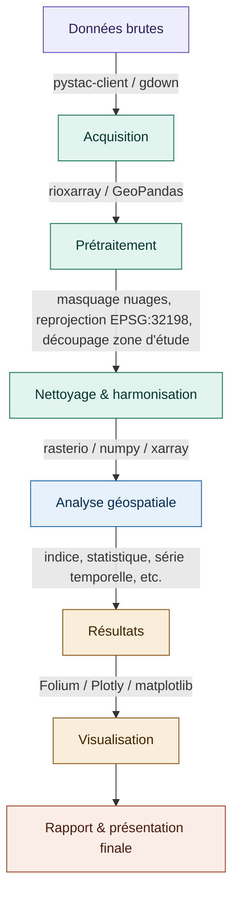
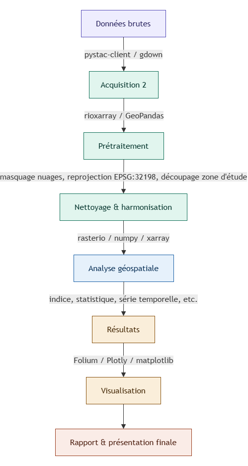

# Titre du projet
**Équipe :** Prénom Nom / Prénom Nom  
*Changez le titre du projet, il peut évoluer dans le temps. Nommez les membres du groupe*

## Problématique
*Une courte description de l'objectif du projet*

*Par exemple, posez-vous les questions suivantes :* 
- *Quel phénomène ou enjeu géomatique voulez-vous étudier ?*
- *Pourquoi ce sujet est-il pertinent dans la région choisie ?*
- *Qui serait concerné par les résultats (municipalité, citoyens, urbanistes, chercheurs) ?*
- *Qu'est-ce que vous n'allez pas traiter, pour rester réaliste dans le temps disponible ?*
- *Travaillez-vous à l'échelle du bâtiment, du quartier, de la ville, de la région ?*
- *Avez-vous déjà identifié une source de données qui permettrait de répondre à cette question ?*
- *...*

## Zone d'étude
*Localisation, échelle, pourquoi ce choix ?*

## Données
*Listez les données pertinentes*
| Source | Format | CRS | Accès |
|--------|--------|-----|-------|
|        |        |     |       |

## Modèle de données
*Cette section peut être utile si on s'oriente vers une architecture client/serveur/base de données. On pourra expliquer notre modèle de données.*

## Pipeline de traitement ou Architecture
*Si on souhaite faire simplement un pipeline de traitement, on peut expliquer les étapes. Ou alors proposer une architecture pour une application (ex: client/serveur/db).*

*Schéma ou diagramme Mermaid (https://mermaid.live/)*

*Si Mermaid est compliqué, on utilise un outil pour faire des diagrammes (https://app.diagrams.net/), on peut simplement utiliser l'image du diagramme.*

## Librairies principales (ou stack)
*Liste avec justification du choix*
*Si on développe un STACK, on doit expliquer ce que contient chaque composante, ex: Flask/FastAPI, PostGIS, Leaflet, ...*

## Livrables attendus
*Ce que le projet produira concrètement*

## État d'avancement
*Faites un petit tableau avec des tâches ou des étapes à compléter*
| Étape | Statut |
|-------|--------|
| Acquisition des données | ✅ Complété |
| Masquage nuageux | 🔄 En cours |
| Analyse temporelle | ⏳ À faire |

## Décisions méthodologiques
*Journal des choix importants avec justification  (mis à jour à chaque séance)*

## Difficultés rencontrées
*Problèmes résolus et en cours*