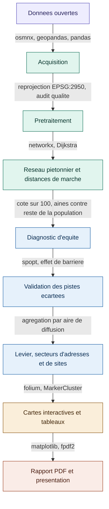

# Où vieillir à pied dans la Vallée du Richelieu, équité d'accès des aînés aux services essentiels et secteurs recommandés
**Équipe.** Mylène Giraldeau


## Problématique
L'accès à pied aux services essentiels est un enjeu d'autonomie. Les personnes de 65 ans et plus sont le groupe vulnérable principal. Plusieurs cessent de conduire tout en marchant encore sur de courtes distances. L'environnement bâti du quartier influence directement leurs déplacements actifs (Cerin et al., 2017). L'Organisation mondiale de la Santé (2007) fait d'ailleurs de la proximité des services un critère central des villes-amies des aînés.

Le projet mesure cet accès à l'échelle du bâtiment, pour chaque résidence des quatre municipalités. **Neuf types de services essentiels sont analysés**, épicerie, pharmacie, santé, dépanneur, banque, dentiste, vétérinaire, école et garderie. La section Données les définit. Le transport collectif n'en fait pas partie. C'est un moyen d'atteindre ces services, pas un service. Il forme le deuxième mode de déplacement après la marche.

Le projet suit trois volets. Le **diagnostic d'équité** compare les aînés au reste de la population et montre que leurs besoins diffèrent. La **validation** écarte deux pistes. L'ajout de nouveaux services rapporte trop peu, et l'effet de barrière de la rivière est négligeable. Le **levier** retient la solution. Il recommande dans chaque ville le meilleur secteur d'adresses déjà existantes et le meilleur secteur où implanter du logement.

Les résultats visent les municipalités et les décideurs publics, communautaires et privés. Le projet reprend et étend l'approche piétonne du cours GMQ210, avec l'accord de l'enseignant. Il se limite au diagnostic et aux recommandations, l'implantation revient aux décideurs. Il n'aborde ni les horaires d'ouverture ni un indice de vulnérabilité multicritère.

## Zone d'étude
Quatre municipalités riveraines contiguës de la Vallée du Richelieu. Beloeil et McMasterville sont sur la rive ouest, Mont-Saint-Hilaire et Otterburn Park sur la rive est. La rivière les sépare et n'est franchissable qu'aux ponts. Le territoire reste donc continu et de taille comparable, tout en permettant de tester un effet de barrière.

Il est traité sans zone tampon. La demande est diffusée par aire de diffusion du Recensement 2021. C'est la plus petite unité pour laquelle toutes les données du recensement sont diffusées, de 400 à 700 habitants (Statistique Canada, 2021). Les distances sont mesurées sur le réseau piétonnier. Quelques services situés juste au-delà des limites ne sont pas comptés. L'effet reste faible car les services se concentrent au cœur des villes.

## Données
Chaque source sert à une chose précise.

- **Ce qui définit les services essentiels.** Les points d'intérêt d'OpenStreetMap, filtrés par les étiquettes du premier tableau. C'est la seule source qui décide de la présence d'un service.
- **Ce qui définit l'accès.** Le réseau piétonnier porte toutes les distances de marche. Les arrêts d'autobus et les gares ajoutent le deuxième mode. Les bâtiments et terrains résidentiels donnent le point de départ de chaque déplacement.
- **Ce qui définit la demande et le contexte.** Le recensement et les aires de diffusion répartissent les aînés et le reste de la population. Les limites municipales rattachent chaque secteur à sa ville. Les terrains commerciaux et les terrains à développer servent de sites candidats. Les lignes de train et la rivière sont des repères cartographiques.

Un service est retenu s'il répond à un besoin courant, s'il se fréquente de façon répétée dans l'année et s'il est bien recensé dans OpenStreetMap.

| Service essentiel | Étiquettes OpenStreetMap | Rôle pour la population |
|-------------------|--------------------------|-------------------------|
| Épicerie | `shop=supermarket` | Achats alimentaires, la sortie la plus fréquente |
| Pharmacie | `amenity=pharmacy`, `healthcare=pharmacy` | Médicaments et suivi des soins |
| Santé | `amenity` hôpital, clinique et médecin, `healthcare` équivalent | Consultation médicale de proximité |
| Dépanneur | `shop=convenience` | Achat de dépannage à pied |
| Banque | `amenity=bank` | Opérations encore faites au comptoir |
| Dentiste | `amenity=dentist`, `healthcare=dentist` | Soins réguliers deux fois par an |
| Vétérinaire | `amenity=veterinary` | Soins des animaux de compagnie |
| École | `amenity=school` | Service structurant pour les familles |
| Garderie | `amenity=kindergarten`, `amenity=childcare` | Service structurant pour les jeunes parents |

L'école et la garderie sont conservées même si les aînés les fréquentent peu. Le diagnostic compare en effet les deux groupes sur les mêmes services. C'est le poids d'importance, propre à chaque groupe, qui traduit la différence d'usage.

| Source | Format | CRS | Accès |
|--------|--------|-----|-------|
| Réseau piétonnier (OpenStreetMap) | Graphe GraphML | EPSG:2950, depuis EPSG:4326 | Extrait via [OSMnx](https://osmnx.readthedocs.io/en/stable/) |
| Services essentiels (OpenStreetMap) | GeoPackage | EPSG:2950, depuis EPSG:4326 | OSMnx, étiquettes du tableau ci-dessus |
| Bâtiments résidentiels (OpenStreetMap) | GeoPackage | EPSG:2950, depuis EPSG:4326 | OSMnx, étiquette `building` |
| Terrains résidentiels (OpenStreetMap) | GeoPackage | EPSG:2950, depuis EPSG:4326 | OSMnx, `landuse=residential`, valide les bâtiments `yes` |
| Terrains commerciaux (OpenStreetMap) | GeoPackage | EPSG:2950, depuis EPSG:4326 | OSMnx, `landuse` commercial et retail, sites candidats de services |
| Terrains à développer (OpenStreetMap) | GeoPackage | EPSG:2950, depuis EPSG:4326 | OSMnx, `landuse` brownfield, greenfield et construction, sites candidats de logement |
| Plans d'eau (OpenStreetMap) | GeoPackage | EPSG:2950, depuis EPSG:4326 | OSMnx, `natural=water`, contexte cartographique |
| Population et aînés par aire de diffusion | CSV | Aucun, table jointe par code d'AD | [Statistique Canada, Recensement 2021](https://www12.statcan.gc.ca/census-recensement/2021/dp-pd/prof/details/download-telecharger.cfm?Lang=F) |
| Limites des aires de diffusion | Shapefile | EPSG:2950, depuis EPSG:3347 | [Statistique Canada, limites 2021](https://www12.statcan.gc.ca/census-recensement/2021/geo/sip-pis/boundary-limites/index2021-fra.cfm?year=21) |
| Limites municipales | Shapefile | EPSG:2950, depuis EPSG:4269 | [Données Québec, découpages administratifs](https://www.donneesquebec.ca/recherche/dataset/decoupages-administratifs/resource/b368d470-71d6-40a2-8457-e4419de2f9c0) |
| Arrêts d'autobus (exo, Vallée du Richelieu) | GTFS | EPSG:2950, depuis EPSG:4326 | [exo, données ouvertes](https://exo.quebec/fr/a-propos/donnees-ouvertes) |
| Gares de train (exo) | GeoJSON | EPSG:2950, depuis EPSG:4326 | [Données Québec, gares exo](https://www.donneesquebec.ca/recherche/dataset/gares-de-train-exo/resource/8c169002-866c-40e8-babd-2be7186cb17c) |
| Lignes de train (exo) | GeoJSON | EPSG:2950, depuis EPSG:4326 | [Données Québec, lignes exo](https://www.donneesquebec.ca/recherche/dataset/lignes-de-train-exo/resource/0f7d6393-e43e-48b3-ab8c-a3d48b36cac6) |

Toutes les couches sont ramenées au CRS cible commun EPSG:2950 avant analyse, soit NAD83(CSRS) / MTM zone 8. Les données brutes ne sont pas versionnées. `download_data.py` régénère les couches OpenStreetMap, les autres se téléchargent depuis les liens ci-dessus.

## Modèle de données
Le projet écrit ses couches en GeoPackage, un format de base de données spatiale sur fichier. Il suffit ici car les données tiennent sur un poste, l'analyse est relue d'un bout à l'autre à chaque exécution et un seul auteur y travaille. Un serveur PostGIS deviendrait nécessaire si plusieurs personnes écrivaient en même temps, si le territoire dépassait la mémoire d'un poste ou s'il fallait interroger les couches depuis une application.

| Entité | Clé | Liens |
|--------|-----|-------|
| Résidence | `residence_id` | rattachée à une aire par `IDUGD`, accrochée au réseau par `node` |
| Aire de diffusion | `IDUGD` | porte la population et les aînés, rattachée à une municipalité |
| Municipalité | `MUS_NM_MUN` | contient les aires et les résidences |
| Service essentiel | `service_type` | accroché au réseau par `node` |
| Arrêt et gare | `stop_id` | rattaché à une ligne du GTFS par `route_id` |
| Terrain candidat | `site_id` | accroché au réseau par `node` |
| Secteur recommandé | `ad_id` | l'aire retenue d'une municipalité |

## Pipeline de traitement
L'arborescence suit le principe d'un module pour une responsabilité. `main.py` orchestre seulement, tout le traitement est délégué aux modules de `src`.



**Ce que fait chaque case.**
- **A à C, acquisition et prétraitement.** `download_data.py` régénère les couches OpenStreetMap et `src/extraction` lit les autres sources. Suivent la reprojection vers EPSG:2950, l'audit de qualité, la correction des géométries et la répartition de la demande par aire de diffusion.
- **D, distances de marche.** Chaque résidence et chaque service sont accrochés au nœud le plus proche du graphe. Dijkstra donne la distance réelle vers le service le plus proche de chaque type. Les arrêts d'autobus et les gares servent ici. Ils ouvrent un second chemin, marcher jusqu'à un arrêt, prendre l'autobus ou le train, puis marcher de l'arrêt d'arrivée vers le service. Les deux arrêts doivent appartenir à la même ligne du GTFS, le projet ne modélise aucun transfert. La marche totale du trajet est la somme des deux marches et elle doit respecter le total acceptable du groupe. Ce chemin n'est retenu que s'il bat la marche directe.
- **E et F, diagnostic et validation.** Cote sur 100 par résidence et comparaison des deux groupes. Puis couverture maximale pour l'ajout de services. L'effet de barrière est mesuré en retirant les liens qui traversent les ponts.
- **G, levier.** Agrégation des adresses notées et des terrains à développer par aire de diffusion. La meilleure aire de chaque municipalité est ensuite retenue.
- **H et I, diffusion.** Deux cartes folium, les tableaux CSV et le rapport PDF. Les lignes de train n'interviennent qu'ici, comme repère cartographique.

## Librairies principales
- **osmnx**, téléchargement du réseau, des points d'intérêt et des couches d'usage du sol d'OpenStreetMap (Boeing, 2017).
- **networkx**, plus courts chemins avec l'algorithme de Dijkstra (1959), pour des distances de marche réelles et non à vol d'oiseau.
- **geopandas**, **pandas**, **shapely**, **pyproj**, **rtree**, **numpy** et **mapclassify**, manipulation des données géospatiales et tabulaires, géométries, reprojections, index spatial et calcul matriciel.
- **spopt (PySAL)** et **pulp**, couverture maximale (Church and ReVelle, 1974), le modèle de la validation d'ajout de services. Il sert de deux façons. À chaque étape de l'assortiment, il place un service sur la demande encore non couverte. Pour la borne supérieure, il place les cinq services d'un seul coup et donne le vrai optimum, ce qu'un choix étape par étape ne garantit pas. La demande est agrégée par nœud du réseau avant d'entrer dans le modèle. L'agrégation est exacte, deux résidences accrochées au même nœud ont la même distance vers tout candidat. Elle fait passer le modèle de dix sept mille lignes à environ trois mille, ce qui fait tomber le temps de calcul du volet de trente minutes à quelques minutes.
- **folium**, deux cartes interactives, secteurs et clusters colorés par cote moyenne.
- **matplotlib** et **fpdf2**, figures des deux groupes et rapport PDF des trois volets.
- **pyyaml**, lecture de `config.yaml`, où tous les paramètres sont centralisés.
- **pytest** et **pytest-cov**, tests unitaires et couverture, exécutés en intégration continue.

## Installation et environnement
Tous les paramètres sont centralisés dans `config.yaml` et validés par `config_loader.py` avant tout accès aux données. Aucun paramètre n'est codé en dur.

**Avec conda (recommandé)**
```bash
conda env create -f environment.yml
conda activate gmq580_ps_mg
```

**Avec pip**
```bash
python -m venv venv
source venv/bin/activate      # sous Windows, venv\Scripts\activate
pip install -r requirements.txt
```

**Régénérer les données puis exécuter le pipeline**
```bash
python download_data.py       # régénère les couches OSM (non versionnées)
python main.py                # exécute le pipeline complet
```

**Avec Docker (environnement système complet)**
Le `Dockerfile` part d'une image qui contient déjà GDAL et ses dépendances système, ce qui garantit le même résultat sur toute machine.
```bash
docker build -t gmq580_ps_mg .
docker run --rm -v ${PWD}/data:/app/data -v ${PWD}/outputs:/app/outputs gmq580_ps_mg
```

Le pipeline écrit les cartes dans `outputs/maps`, les figures dans `outputs/figures`, les tableaux dans `outputs/tables` et le rapport PDF dans `outputs`.

## Tests et intégration continue
Les tests ciblent les fonctions où un bug reste silencieux mais fausse le résultat spatial. C'est le cas de la reprojection, de la validité des géométries, de la cote d'accessibilité et des tableaux de résultats. Les données de test sont de petits objets synthétiques construits dans les tests, jamais les données réelles.

```bash
pytest tests/ -v                                    # lancer les tests
pytest tests/ --cov=src --cov-report=term-missing   # couverture de code
```

Le workflow GitHub Actions (`.github/workflows/ci.yml`) vérifie `ruff` puis rejoue `pytest` à chaque `push` et `pull request` sur `main`. Le badge en haut du README reflète le dernier passage. Les hooks `pre-commit` appliquent `black` et `ruff` avant chaque commit.

| Test | Vérifie |
|------|---------|
| `test_io.py` | Reprojection correcte vers EPSG:2950 |
| `test_config_loader.py` | Chargement et validation de `config.yaml` |
| `test_graph.py` | Distances de plus court chemin (Dijkstra) sur un mini-graphe connu |
| `test_accessibility.py` | Cote sur 100 par résidence et paliers de distance |
| `test_transit.py` | Lignes fixes du GTFS et marche totale du trajet retenu |
| `test_demand.py` | Répartition des aînés et du reste par aire de diffusion |
| `test_coverage.py` | Indicateur de couverture par groupe |
| `test_buildings.py` | Filtrage des bâtiments résidentiels, cas `yes` croisé avec `landuse=residential` |
| `test_validation.py` | Règles d'audit et détection des liens traversant la rivière |
| `test_optimization.py` | Couverture maximale sur une matrice minuscule à solution connue, dont un cas où le choix simultané bat le choix glouton |
| `test_scenarios.py` | Assortiment d'ajout, agrégation exacte de la demande par nœud et borne supérieure |
| `test_sectors.py` | Meilleure aire retenue par municipalité et rattachement des aires aux villes |
| `test_metrics.py` | Écart aînés reste, effet d'ajout, effet de barrière et tableau de secteurs |

## Livrables attendus
- **Un dépôt reproductible.** Pipeline complet, configuration centralisée, tests en intégration continue et `Dockerfile`.
- **Deux cartes interactives publiées**, [à la marche](https://girm8601.github.io/GMQ580_PS_MGiraldeau/outputs/maps/carte_levier_marche_aines.html) et [au transport](https://girm8601.github.io/GMQ580_PS_MGiraldeau/outputs/maps/carte_levier_transport_aines.html). Chacune montre, par municipalité, le meilleur secteur d'adresses existantes et le meilleur secteur où implanter des logements. Elles sont servies sur GitHub Pages depuis la branche `main`. L'adresse de base est réglée par `report.maps_base_url` dans `config.yaml`, qui alimente aussi les liens du rapport. Chaque carte contient plus de 17 000 résidences, son chargement prend quelques secondes.
- **Un rapport PDF**, `outputs/rapport_projet.pdf`. Il rassemble au même endroit les figures, les tableaux et les liens de cartes des trois volets. Chacun est accompagné du texte qui explique son utilité. Le rapport se lit comme le fil de réflexion du projet. Le diagnostic établit le besoin, la validation écarte deux pistes chiffres à l'appui, le levier propose la solution. Le produire dans le code garantit qu'il reflète toujours les derniers résultats.
- **Les tableaux CSV** de couverture, d'écart aînés reste, d'effet d'ajout de services, de borne supérieure de cet ajout, d'effet de barrière et des secteurs recommandés.
- **Un document écrit** de 10 pages maximum et une présentation orale de 10 minutes.

## État d'avancement
| Étape | Statut |
|-------|--------|
| Cadrage en trois volets et structuration du dépôt | ✅ Complété |
| Acquisition des données et contrôle qualité | ✅ Complété |
| Environnement conda, Docker, tests et intégration continue | ✅ Complété |
| Diagnostic d'équité, cote d'accessibilité et comparaison des deux groupes | ✅ Complété |
| Validation, ajout de services et effet de barrière écartés | ✅ Complété |
| Levier, meilleur secteur par municipalité, marche et transport | ✅ Complété |
| Cartes publiées, tableaux, graphiques et rapport PDF | ✅ Complété |
| Préparation de la présentation orale | ✅ Complété |
| Rédaction du rapport écrit | 🔄 En cours |

## Décisions méthodologiques
- **Réorientation vers les services essentiels et reprise de GMQ210 (2026-06-23).** La zone était déjà saturée d'arrêts à la demande. Le projet a donc évolué du transport vers l'accessibilité aux services essentiels. Il reprend l'approche piétonne de GMQ210, avec l'accord de l'enseignant, soit OSM, Dijkstra et une cote sur 100 par résidence. La pondération par la vulnérabilité y est ajoutée.
- **Zone d'étude sans zone tampon (2026-07-07).** Les quatre municipalités sont intégrées au même titre. Une zone tampon laissait des vides incohérents à l'affichage dans les aires de McMasterville et d'Otterburn Park.
- **Facteur de vulnérabilité et cote par résidence (2026-07-14).** Le critère retenu est les 65 ans et plus, une donnée robuste du recensement. Chaque résidence reçoit une cote sur 100 selon sa distance de marche vers chaque service, pondérée par l'importance de ce service. Les aînés sont notés Excellent à moins de 200 mètres. Le reste l'est à moins de 400 mètres, car il tolère une marche plus longue. Ces paliers suivent les distances de marche observées selon le motif du déplacement et le sous-groupe de population (Yang and Diez-Roux, 2012). Le principe d'une cote décroissante avec la distance reprend celui du Walk Score (s.d.).
- **Poids d'importance fondés sur la littérature (2026-07-16).** Les poids varient selon le type de service. Ils reposent sur les distances observées par motif de déplacement (Yang and Diez-Roux, 2012) et sur la pondération par catégorie d'attrait du Walk Score (s.d.), et non sur un jugement personnel.
- **Étiquettes OSM élargies (2026-07-17).** Les étiquettes `healthcare` et `amenity=childcare` captent les établissements tagués autrement dans OSM.
- **Le reste de la population comme groupe de comparaison (2026-07-23).** Le groupe retenu est la population totale moins les aînés. Il est plus net que le total, qui inclurait les aînés eux-mêmes. Ce groupe est mieux desservi et privilégie des services différents, comme l'école et la garderie. Les aînés ont donc des besoins qui leur sont propres.
- **Transport propre à chaque groupe (2026-07-23).** La marche totale acceptable d'un déplacement est de 800 mètres pour les aînés et de 1000 mètres pour le reste. L'effet de barrière est mesuré pour chaque groupe à son seuil.
- **Retrait de la CMM au profit des étiquettes landuse d'OSM (2026-07-23).** Les données de la CMM contenaient trop d'erreurs de classement. Les bâtiments `yes` sont confirmés par `landuse=residential`. Les sites candidats de services viennent de `landuse` commercial et retail. Ceux de logement viennent des terrains à développer, friche, terrain vierge et chantier. Le brownfield est conservé pour la reproductibilité même s'il est absent de la zone.
- **Étude d'ajout de services limitée à cinq (2026-07-23).** L'ajout est étudié de 1 à 5 services précis pour chaque groupe. La courbe de gain est tracée sur l'échelle complète de 0 à 100, pour que la faiblesse du gain se voie. L'étude appartient à la validation.
- **Levier par secteurs d'aires de diffusion (2026-07-23).** Le levier propose des secteurs plutôt que des points précis. Cela évite la concentration et donne des options lisibles. Chaque secteur est un polygone d'aire coloré par sa cote qualitative moyenne, avec un carré pictogramme au centroïde.
- **Rapport PDF de diffusion (2026-07-23).** Le rapport est généré par le pipeline. La page titre porte le logo de l'Université de Sherbrooke, le nom n'est pas répété puisque le logo le porte. Suivent les trois volets, chacun avec sa figure, ses tableaux, ses liens de cartes, une introduction et une conclusion.
- **Un secteur de chaque type par municipalité (2026-07-28).** Le classement global concentrait les recommandations dans une seule ville. Le levier retient maintenant deux aires par municipalité, la mieux cotée selon les adresses existantes et la mieux cotée selon les terrains à développer. Cela donne huit secteurs au maximum par carte. Une ville sans terrain n'obtient pas de secteur de logement. Une aire est rattachée à la municipalité qui la recouvre le plus.
- **Cartes complètes et lisibles (2026-07-28).** Un cluster de résidences prend la couleur de la cote moyenne de ses points. La couleur garde ainsi partout le même sens. Les deux cartes sont versionnées et servies telles quelles sur GitHub Pages, plutôt que résumées en images statiques. Le lecteur garde donc l'interactivité complète.
- **Coordonnées exportées en latitude et longitude (2026-07-28).** Les tableaux CSV donnent la position en degrés décimaux WGS84 plutôt qu'en mètres MTM 8. Ils sont ainsi utilisables sans connaître le CRS du projet.
- **Trajet réel sans transfert (2026-07-30).** Un déplacement par le transport suit une seule ligne du GTFS. Le calcul cherche la ligne qui minimise la marche totale, celle de la résidence vers un arrêt de cette ligne plus celle d'un arrêt de la même ligne vers le service. Les transferts sont exclus, les correspondances possibles ne sont pas diffusées et les modéliser dépasserait le cadre du travail. Le trajet à bord ne compte pas dans le total, le seuil porte sur la marche. Neuf des dix lignes fixes desservent la zone, la ligne de train exo s'y ajoute avec ses deux gares.
- **Borne supérieure du gain par la couverture maximale (2026-07-30).** L'assortiment étape par étape est un choix glouton, il retient le meilleur ajout à chaque tour sans revenir sur les précédents. La couverture maximale de spopt place au contraire les cinq services d'un seul coup, par type de service, et donne donc le vrai optimum. Le résultat est une borne, personne ne peut faire mieux avec cinq services de ce type sur ces terrains. Aucune distance minimale entre sites n'y est imposée, elle est ainsi la plus généreuse possible. Elle montre que même la meilleure implantation laisse la majorité des aînés sans accès au type ajouté, et qu'il faudrait recommencer pour chacun des neuf services. C'est ce qui écarte la piste pour de bon.

## Difficultés rencontrées
- **Complétude et validation d'OpenStreetMap.** La qualité varie en milieu périurbain, pour le réseau comme pour les étiquettes. La franchissabilité piétonne des ponts est validée par `bridges.py`, croisée au besoin avec l'imagerie aérienne. Les terrains à développer peuvent être absents d'une ville. Le pipeline saute alors le secteur de logement concerné.
- **Données du transport à la demande indisponibles.** Les emplacements des arrêts du service exo à la demande ne sont pas diffusés publiquement. L'analyse se limite au réseau fixe, ce qui garde le traitement reproductible.
- **Hétérogénéité des systèmes de coordonnées.** Les sources arrivent dans des CRS différents. Une fonction de reprojection unique vers EPSG:2950 est appliquée à toutes les couches avant analyse, et couverte par un test unitaire. Elle évite les jointures spatiales silencieusement fausses.
- **Agrégation du recensement et effet de bordure.** Le compte d'aînés et du reste d'une aire est réparti sur les résidences de cette aire. Tout le reste du calcul demeure entre points précis. Les services juste au-delà des limites ne sont pas comptés, mais ils se concentrent au cœur des villes. L'effet résiduel est donc jugé faible.
- **Modélisation simplifiée et pondérations non validées.** Un seul critère de vulnérabilité est retenu. Chaque service d'un même type est traité comme équivalent, sans égard à sa taille. Les poids d'importance suivent la littérature, sans consultation de la communauté aînée. Une enquête permettrait de les valider, et la configuration centralisée rend cet ajustement immédiat.

## Références
Anthropic (2026) Claude [Assistant d'intelligence artificielle générative]. Anthropic, San Francisco [En ligne]. https://claude.ai (outil utilisé en juillet 2026).

Boeing, G. (2017) OSMnx: new methods for acquiring, constructing, analyzing, and visualizing complex street networks. Computers, Environment and Urban Systems, vol. 65, p. 126-139.

Cerin, E., Nathan, A., van Cauwenberg, J., Barnett, D.W. and Barnett, A. (2017) The neighbourhood physical environment and active travel in older adults: a systematic review and meta-analysis. International Journal of Behavioral Nutrition and Physical Activity, vol. 14, no 1, article 15.

Church, R. and ReVelle, C. (1974) The maximal covering location problem. Papers in Regional Science, vol. 32, no 1, p. 101-118.

Dijkstra, E.W. (1959) A note on two problems in connexion with graphs. Numerische Mathematik, vol. 1, no 1, p. 269-271.

Organisation mondiale de la Santé (2007) Guide mondial des villes-amies des aînés. Organisation mondiale de la Santé, Genève, 76 p.

Statistique Canada (2021) Aire de diffusion (AD). *In* Dictionnaire, Recensement de la population, 2021, Gouvernement du Canada [En ligne]. https://www12.statcan.gc.ca/census-recensement/2021/ref/dict/az/definition-fra.cfm?ID=geo021 (page consultée le 17 juillet 2026).

Walk Score (s.d.) Walk Score Methodology [En ligne]. https://www.walkscore.com/methodology.shtml (page consultée le 17 juillet 2026).

Yang, Y. and Diez-Roux, A.V. (2012) Walking distance by trip purpose and population subgroups. American Journal of Preventive Medicine, vol. 43, no 1, p. 11-19.
