# Équité piétonne face à la barrière fluviale : optimisation des services essentiels à Beloeil et Mont-Saint-Hilaire
**Équipe :** Mylène Giraldeau

## Problématique
L'accès aux services essentiels à pied est un enjeu d'autonomie et d'inclusion pour les résidents qui ne disposent pas d'un accès facile à l'automobile. Les personnes âgées (65 ans et plus) en sont le groupe vulnérable candidat principal : plusieurs cessent de conduire tout en demeurant capables de marcher sur de courtes distances. Le facteur de vulnérabilité exact sera confirmé en cours de projet.

Le projet porte sur Beloeil (rive ouest) et Mont-Saint-Hilaire (rive est), séparées par la rivière Richelieu, franchissable seulement aux ponts. Cette barrière structure fortement l'accessibilité piétonne entre les deux rives, ce qui en fait un cas pertinent pour étudier l'équité d'accès.

Le projet évalue si les résidents les plus dépendants de la marche disposent d'un accès équitable aux services essentiels, afin de déterminer la nature et la localisation des nouveaux services à implanter pour maximiser la couverture. Il reprend et étend, avec l'accord de l'enseignant, le projet de session du cours GMQ210. 

Les résultats concernent les villes visées et les décideurs publics, communautaires et privés. Le projet se limite à un diagnostic prospectif (l'implantation réelle revient aux décideurs) et n'aborde ni les horaires d'ouverture ni un indice de vulnérabilité multicritère. 

La demande est analysée à l'échelle de l'aire de diffusion (Recensement 2021).

## Zone d'étude
Le territoire couvre Beloeil (rive ouest) et Mont-Saint-Hilaire (rive est), séparées par la rivière Richelieu. La demande est analysée à l'échelle de l'aire de diffusion, et les distances à l'échelle du réseau piétonnier. 

Une zone tampon incluant les secteurs contigus de McMasterville et d'Otterburn Park sert à extraire le réseau et les services existants, afin d'éviter les effets de bordure. 

La demande n'est toutefois mesurée que dans Beloeil et Mont-Saint-Hilaire. Ce choix se justifie par la rivière, franchissable seulement aux ponts, qui contraint fortement l'accessibilité piétonne entre les deux rives.

## Données

| Source | Format | CRS | Accès |
|--------|--------|-----|-------|
| Réseau piétonnier (OpenStreetMap) | Graphe (GraphML) | EPSG:2950 (MTM 8) | Extrait via OSMnx, reprojeté depuis EPSG:4326 |
| Points d'intérêt, services essentiels (OpenStreetMap) | Vectoriel (GeoPackage) | EPSG:2950 (MTM 8) | Extrait via OSMnx (étiquettes `amenity`, `shop`) |
| Bâtiments résidentiels (OpenStreetMap) | Vectoriel (GeoPackage) | EPSG:2950 (MTM 8) | Extrait via OSMnx (étiquette `building`) |
| Population et aînés (65 ans et plus) par aire de diffusion | CSV tabulaire | Aucun (table jointe par code d'AD) | Statistique Canada, Recensement 2021 |
| Limites des aires de diffusion | Shapefile | EPSG:2950 (MTM 8) | Statistique Canada |
| Limites municipales | Shapefile | EPSG:2950 (MTM 8) | Données Québec |
| Données complémentaires à OSM | Shapefile / GeoJSON / GeoPackage | EPSG:2950 (MTM 8) | Données Québec, villes |
| Contraintes territoriales (utilisation du sol) | Raster (GeoTIFF) | EPSG:2950 (MTM 8) | Données Québec |

## Modèle de données
Ce projet n'utilise pas de serveur de base de données.

## Pipeline de traitement
**Structure du projet évolutive.** L'arborescence suit le principe « un module, une responsabilité » et reprend les catégories du cours. Elle pourra évoluer en cours de route. Des modules très courts et toujours modifiés ensemble pourront être fusionnés, et de nouveaux pourront être ajoutés si une étape se précise.

Le traitement suit une chaîne séquentielle et reproductible. L'accessibilité est mesurée de deux façons complémentaires : une cote par type de service par lieu résidentiel, qui révèle quel service manque et où, et un indicateur de couverture des résidents vulnérables par aire de diffusion, qui pilote l'optimisation. L'optimisation par couverture maximale détermine à la fois où ajouter des services et de quels types.

```mermaid
flowchart TD
    A["Données ouvertes<br/>OSM, Recensement 2021 (StatCan), Données Québec"]

    subgraph P1["1. Acquisition et préparation"]
        B["Acquisition des données"]
        C["Vérification et contrôle qualité"]
        D["Validation de la franchissabilité<br/>des ponts dans le graphe"]
        E["Délimitation de la zone d'étude<br/>Beloeil et Mont-Saint-Hilaire, zone tampon"]
    end

    subgraph P2["2. Analyse d'accessibilité (état actuel, S0)"]
        F["Réseau piétonnier, distances de marche<br/>(Dijkstra)"]
        G["Cote d'accessibilité<br/>par type de service"]
        H["Indicateur de couverture<br/>des résidents vulnérables"]
        I["Demande pondérée par la vulnérabilité<br/>(aînés par aire de diffusion)"]
    end

    subgraph P3["3. Optimisation (scénario S1)"]
        J["Définition et filtrage<br/>des sites candidats"]
        K["Optimisation par couverture maximale<br/>où et quel type, n de 1 à 5"]
        L["Analyse de sensibilité d'équité<br/>pondération vulnérable ou totale"]
    end

    subgraph P4["4. Résultats et diffusion"]
        M["Gains de couverture (S0 et S1)<br/>et effet de barrière de la rivière"]
        N["Visualisation<br/>cartes interactives, courbe de gain"]
        O["Rapport écrit et présentation orale"]
    end

    A -->|"osmnx, pandas"| B
    B --> C
    C -->|"networkx"| D
    D -->|"geopandas"| E
    E -->|"networkx, Dijkstra"| F
    F --> G
    F --> H
    G -->|"pandas, geopandas"| I
    H --> I
    I -->|"geopandas"| J
    J -->|"spopt, PySAL"| K
    K --> L
    K --> M
    L --> M
    M -->|"folium, matplotlib"| N
    N --> O

    style A fill:#EEEDFE,stroke:#534AB7,color:#26215C
    style B fill:#E1F5EE,stroke:#0F6E56,color:#04342C
    style C fill:#E1F5EE,stroke:#0F6E56,color:#04342C
    style D fill:#E1F5EE,stroke:#0F6E56,color:#04342C
    style E fill:#E1F5EE,stroke:#0F6E56,color:#04342C
    style F fill:#E6F1FB,stroke:#185FA5,color:#042C53
    style G fill:#E6F1FB,stroke:#185FA5,color:#042C53
    style H fill:#E6F1FB,stroke:#185FA5,color:#042C53
    style I fill:#E6F1FB,stroke:#185FA5,color:#042C53
    style J fill:#E8EEF9,stroke:#3B53A4,color:#1B244F
    style K fill:#E8EEF9,stroke:#3B53A4,color:#1B244F,stroke-width:2px
    style L fill:#E8EEF9,stroke:#3B53A4,color:#1B244F
    style M fill:#FAEEDA,stroke:#854F0B,color:#412402
    style N fill:#FAEEDA,stroke:#854F0B,color:#412402
    style O fill:#FAECE7,stroke:#993C1D,color:#4A1B0C
```

## Librairies principales
- **osmnx** : téléchargement et modélisation du réseau piétonnier et des points d'intérêt d'OpenStreetMap.
- **networkx** : plus courts chemins avec l'algorithme de Dijkstra pour mesurer les distances réelles de marche.
- **geopandas / pandas** : manipulation des données géospatiales et tabulaires, jointures et reprojections (EPSG:2950).
- **spopt (PySAL)** : modèle de localisation-allocation à couverture maximale.
- **folium** : cartes de couverture interactives avant et après optimisation.
- **matplotlib** : graphiques de performance, dont la courbe de rendement de l'ajout de 1 à 5 services.

## Livrables attendus
- Un dépôt GitHub reproductible contenant l'ensemble du pipeline.
- Une carte interactive de la couverture actuelle (S0) des populations vulnérables.
- Une carte interactive des scénarios optimisés (S1) avec la localisation et le type des services recommandés.
- Une courbe de gain selon le nombre de services ajoutés (de 1 à 5).
- Une analyse de sensibilité d'équité (pondération vulnérable contre population totale).
- Un chiffrage de l'effet de barrière de la rivière Richelieu.
- Un rapport final écrit (15 à 20 pages) et une présentation orale (10 à 15 minutes).

## État d'avancement

| Étape | Statut |
|-------|--------|
| Cadrage et réorientation du projet (services essentiels) | ✅ Complété |
| Structuration du dépôt GitHub (arborescence du projet, `.gitignore`, branches) | 🔄 En cours |
| Acquisition des données (OSM, recensement, Données Québec) | 🔄 En cours |
| Vérification et contrôle qualité des données | ⏳ À faire |
| Validation de la franchissabilité des ponts dans le graphe | ⏳ À faire |
| Délimitation de la zone d'étude et de la zone tampon | ⏳ À faire |
| Calcul de l'accessibilité par type de service (état actuel, S0) | ⏳ À faire |
| Pondération de la demande par la vulnérabilité (aînés par AD) | ⏳ À faire |
| Définition et filtrage des sites candidats | ⏳ À faire |
| Optimisation par couverture maximale avec `spopt` (S1, n = 1 à 5) | ⏳ À faire |
| Analyse de sensibilité d'équité | ⏳ À faire |
| Production des résultats (gains, effet de barrière) | ⏳ À faire |
| Cartes interactives et graphiques | ⏳ À faire |
| Rédaction du rapport et préparation de la présentation orale | ⏳ À faire |

## Décisions méthodologiques
- **Réorientation du projet.** Après le constat que la zone était déjà saturée d'arrêts à la demande (ancienne version sur le transport collectif), le projet a évolué vers l'accessibilité aux services essentiels, ce qui permet aussi d'optimiser le type de service à ajouter.
- **Reprise et extension de GMQ210.** Avec l'accord de l'enseignant, le projet réutilise l'approche d'accessibilité piétonne de GMQ210 (OSM, Dijkstra, cotation par type), à laquelle s'ajoutent la pondération par la vulnérabilité, la barrière fluviale et l'optimisation.
- **Facteur de vulnérabilité.** Le choix de travail s'arrête sur les 65 ans et plus, une donnée robuste du recensement qui évite les biais des données manquantes et des indices composites. Le facteur exact demeure révisable et sera justifié.
- **Mesure par la couverture.** La couverture, plutôt que la distance moyenne, est retenue comme indicateur principal ; les seuils de marche seront fixés à partir des paliers de GMQ210 ou de valeurs usuelles comme 400 et 800 mètres.
- **Posture diagnostique.** L'optimisation indique où le manque est le plus grand et quel type de service le comblerait le mieux, ce qui sert autant les décideurs publics et communautaires que les acteurs privés.

## Difficultés rencontrées
- **Complétude d'OpenStreetMap.** La qualité des données en milieu périurbain (Beloeil et Mont-Saint-Hilaire) peut varier, pour le réseau comme pour les services. Un croisement avec Données Québec et les inventaires municipaux est planifié pour combler les manques.
- **Effet de bordure spatiale.** Découper l'analyse strictement aux frontières municipales aurait ignoré des commerces limitrophes essentiels ; la zone tampon règle ce problème, tout en mesurant la demande uniquement dans Beloeil et Mont-Saint-Hilaire.
- **Agrégation des données de recensement.** La demande est diffusée par aire de diffusion, pas par adresse, alors que le calcul d'accessibilité se fait entre points précis (résidences et services), ce qui introduit une perte de précision à garder en tête.
- **Choix du facteur de vulnérabilité.** Le facteur est limité aux données disponibles. Un seul critère est retenu (65 ans et plus) par souci de simplicité, alors que plusieurs pourraient être combinés et pondérés. Des dimensions d'offre et de demande plus fines sont aussi ignorées par manque de données.